##1. Set-up

Load all the required libraries.


```r
library(tidyverse)
library(sf)
library(ggthemes)
library(viridis)
library(scales)
library(lubridate)
library(brms)
library(arsenal)
library(knitr)
library(here)
library(spdep)
library(broom)
library(RANN)
library(forcats)
library(cowplot)
library(bayesplot)
```

<br>

##2. Reproducibility

This analysis was run on *2018-09-21 14:06:01*, using the following system profile and package versions:


```r
sessionInfo()
```

```
R version 3.5.1 (2018-07-02)
Platform: x86_64-apple-darwin15.6.0 (64-bit)
Running under: macOS High Sierra 10.13.6

Matrix products: default
BLAS: /Library/Frameworks/R.framework/Versions/3.5/Resources/lib/libRblas.0.dylib
LAPACK: /Library/Frameworks/R.framework/Versions/3.5/Resources/lib/libRlapack.dylib

locale:
[1] en_GB.UTF-8/en_GB.UTF-8/en_GB.UTF-8/C/en_GB.UTF-8/en_GB.UTF-8

attached base packages:
[1] stats     graphics  grDevices utils     datasets  methods   base     

other attached packages:
 [1] bayesplot_1.6.0   cowplot_0.9.3     RANN_2.6         
 [4] broom_0.5.0       spdep_0.7-7       spData_0.2.9.3   
 [7] Matrix_1.2-14     sp_1.3-1          here_0.1         
[10] knitr_1.20        arsenal_1.3.0     brms_2.4.0       
[13] Rcpp_0.12.18      lubridate_1.7.4   scales_1.0.0     
[16] viridis_0.5.1     viridisLite_0.3.0 ggthemes_4.0.0   
[19] sf_0.6-3          forcats_0.3.0     stringr_1.3.1    
[22] dplyr_0.7.6       purrr_0.2.5       readr_1.1.1      
[25] tidyr_0.8.1       tibble_1.4.2      ggplot2_3.0.0    
[28] tidyverse_1.2.1  

loaded via a namespace (and not attached):
 [1] colorspace_1.3-2     deldir_0.1-15        class_7.3-14        
 [4] ggridges_0.5.0       rsconnect_0.8.8      rprojroot_1.3-2     
 [7] markdown_0.8         base64enc_0.1-3      rstudioapi_0.7      
[10] rstan_2.17.3         DT_0.4               mvtnorm_1.0-8       
[13] xml2_1.2.0           splines_3.5.1        bridgesampling_0.4-0
[16] shinythemes_1.1.1    jsonlite_1.5         shiny_1.1.0         
[19] compiler_3.5.1       httr_1.3.1           backports_1.1.2     
[22] assertthat_0.2.0     lazyeval_0.2.1       cli_1.0.0           
[25] later_0.7.3          htmltools_0.3.6      tools_3.5.1         
[28] bindrcpp_0.2.2       igraph_1.2.2         coda_0.19-1         
[31] gtable_0.2.0         glue_1.3.0           reshape2_1.4.3      
[34] gmodels_2.18.1       cellranger_1.1.0     gdata_2.18.0        
[37] nlme_3.1-137         crosstalk_1.0.0      testthat_2.0.0      
[40] rvest_0.3.2          mime_0.5             miniUI_0.1.1.1      
[43] gtools_3.8.1         LearnBayes_2.15.1    MASS_7.3-50         
[46] zoo_1.8-3            colourpicker_1.0     hms_0.4.2           
[49] promises_1.0.1       Brobdingnag_1.2-6    parallel_3.5.1      
[52] expm_0.999-2         inline_0.3.15        shinystan_2.5.0     
[55] yaml_2.2.0           gridExtra_2.3        loo_2.0.0           
[58] StanHeaders_2.17.2   stringi_1.2.4        dygraphs_1.1.1.6    
[61] e1071_1.7-0          boot_1.3-20          rlang_0.2.1         
[64] pkgconfig_2.0.2      matrixStats_0.54.0   evaluate_0.11       
[67] lattice_0.20-35      bindr_0.1.1          rstantools_1.5.0    
[70] htmlwidgets_1.2      tidyselect_0.2.4     plyr_1.8.4          
[73] magrittr_1.5         R6_2.2.2             DBI_1.0.0           
[76] pillar_1.3.0         haven_1.1.2          withr_2.1.2         
[79] units_0.6-0          xts_0.10-2           abind_1.4-5         
[82] modelr_0.1.2         crayon_1.3.4         rmarkdown_1.10      
[85] grid_3.5.1           readxl_1.1.0         threejs_0.3.1       
[88] digest_0.6.15        classInt_0.2-3       xtable_1.8-2        
[91] httpuv_1.4.5         stats4_3.5.1         munsell_0.5.0       
[94] shinyjs_1.0         
```

<br>

##3. Map theme

Create a base theme function for the maps.


```r
map_light <- function(...) {
  theme_minimal() +
  theme(
    text = element_text(family = "Helvetica", color = "#22211d"),
    axis.line = element_blank(),
    axis.text.x = element_blank(),
    axis.text.y = element_blank(),
    axis.ticks = element_blank(),
    axis.title.x = element_blank(),
    axis.title.y = element_blank(),
    panel.grid.major = element_line(color = "#ebebe5", size = 0.2),
    panel.grid.minor = element_blank(),
    plot.background = element_rect(fill = "white", color = NA), 
    panel.background = element_rect(fill = "white", color = NA), 
    legend.background = element_rect(fill = "white", color = NA),
    panel.border = element_blank(),
    ...
  )
}
```

<br>

##4. Figure 1: Total population

Describe summary characteristics of the population.


```r
data("dat", package="BlantyreTBEpi")

dat %>%
  st_set_geometry(., NULL) %>%
  summarise(total=sum(total))
```

```
##    total
## 1 753489
```

```r
dat %>%
  st_set_geometry(., NULL) %>%
  summarise(min=min(total))
```

```
##   min
## 1 162
```

```r
dat %>%
  st_set_geometry(., NULL) %>%
  summarise(max=max(total))
```

```
##     max
## 1 13066
```

```r
dat %>%
  st_set_geometry(., NULL) %>%
  summarise(mean=mean(total),
            sd= sd(total))
```

```
##       mean       sd
## 1 2392.029 1510.424
```

```r
dat %>%
  st_set_geometry(., NULL) %>%
  summarise(median=median(total),
            i25=quantile(total, probs = 0.25),
            i75=quantile(total, probs = 0.75))
```

```
##   median    i25  i75
## 1   2043 1337.5 3035
```

```r
dat %>%
  st_set_geometry(., NULL) %>%
  summarise(min_m_f_adult_ratio = min(m_f_adult_ratio),
            mean_m_f_adult_ratio = mean(m_f_adult_ratio),
            max_m_f_adult_ratio = max(m_f_adult_ratio))
```

```
##   min_m_f_adult_ratio mean_m_f_adult_ratio max_m_f_adult_ratio
## 1            0.826087             1.044611            1.345912
```

```r
dat %>%
  st_set_geometry(., NULL) %>%
  summarise(min_prop_adults = min(prop_adults),
            mean_prop_adults = mean(prop_adults),
            max_prop_adults = max(prop_adults))
```

```
##   min_prop_adults mean_prop_adults max_prop_adults
## 1        44.42997         61.52605        77.97764
```

```r
dat %>%
  st_set_geometry(., NULL) %>%
  summarise(min_pov = min(mwi11povcons200),
            mean_pov = mean(mwi11povcons200),
            max_pov = max(mwi11povcons200))
```

```
##    min_pov mean_pov  max_pov
## 1 13.29293 32.74659 78.60181
```


Plot the total population of Blantyre.


```r
data("dat", package="BlantyreTBEpi")
data("clinics", package="BlantyreTBEpi")

g1<- ggplot() +
  geom_sf(data = dat, aes(fill = total)) +
  geom_sf(data=clinics, shape=17, colour="#22211d") +
  map_light() +
  scale_fill_viridis(option = "magma", direction = -1,
                     name ="Count",
                     labels=comma) +
  labs(x = NULL, 
       y = NULL) +
  theme(legend.text.align = 1)

g1
```

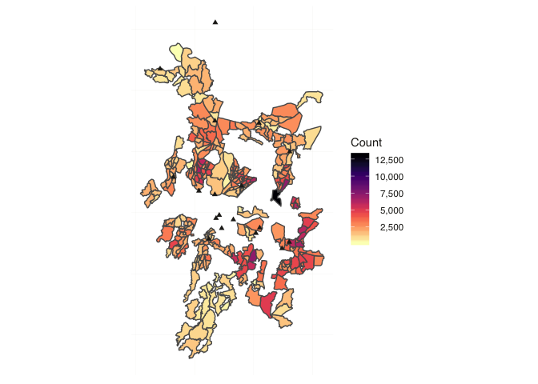<!-- -->

```r
ggsave(file="Figure1.pdf", width=6, height=6, dpi=300, 
       path = here("figures"))
```

<br>

##5. Population density

Plot the population density of Blantyre.


```r
g2 <- ggplot() +
  geom_sf(data = dat, aes(fill = popdens)) +
  geom_sf(data=clinics, shape=17, colour="#22211d") +
  map_light() +
  scale_fill_viridis(option = "magma", direction = -1,
                     name = expression ("Population\nper\nsquare km"),
                     labels=comma) +
  labs(x = NULL, 
       y = NULL) +
  theme(legend.text.align = 1)

g2
```

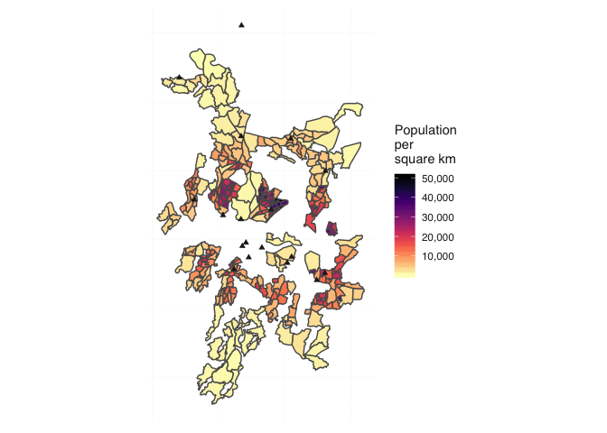<!-- -->

```r
ggsave(file="popdensity.pdf", width=6, height=6, dpi=300, 
       path = here("figures"))
```

<br>

##6. People per household

Plot the mean people per household Blantyre.


```r
g3 <- ggplot() +
  geom_sf(data = dat, aes(fill = mean_people_per_hh)) +
  geom_sf(data=clinics, shape=17, colour="#22211d") +
  map_light() +
  scale_fill_viridis(option = "magma", direction = -1,
                     name = expression ("Mean number\nof people\nper household"),
                     labels=comma) +
  labs(x = NULL, 
       y = NULL) +
  theme(legend.text.align = 1)

g3
```

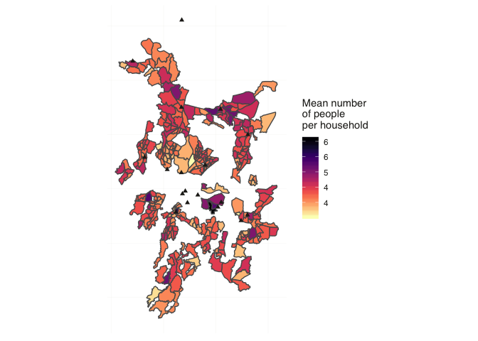<!-- -->

```r
ggsave(file="mean_hh_people.pdf", width=6, height=6, dpi=300, 
       path = here("figures"))
```

<br>

##7. Poverty distribution

Plot the estimaed mean proportion of the population living on less than $2 per day. [Note this is estimated from Worldpop data]


```r
g4 <- ggplot() +
  geom_sf(data = dat, aes(fill = mwi11povcons200)) +
  geom_sf(data=clinics, shape=17, colour="#22211d") +
  map_light() +
  scale_fill_viridis(option = "magma", direction = -1,
                     name = expression ("Mean percentage\nof people\nliving on\nless than\nUS $2 per day"),
                     labels=comma,
                     limits = c(0,100)) +
  labs(x = NULL, 
       y = NULL) +
  theme(legend.text.align = 1)

g4
```

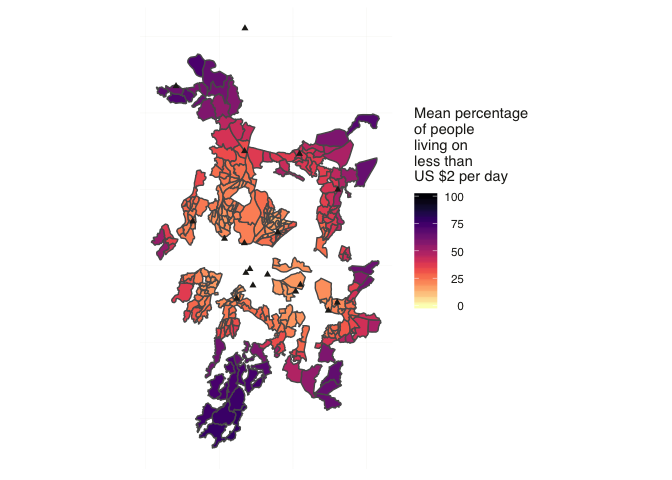<!-- -->

```r
ggsave(file="poverty.pdf", width=6, height=6, dpi=300, 
       path = here("figures"))
```

<br>

##8. Distance to nearest TB registration site


```r
data("dat", package="BlantyreTBEpi")

g5 <- ggplot() +
  geom_sf(data = dat, aes(fill = clinic_distance)) +
  geom_sf(data=clinics, shape=17, colour="#22211d") +
  map_light() +
  scale_fill_viridis(option = "magma", direction = -1,
                     name = expression ("Distance (m)\nto nearest\nTB registration\ncentre"),
                     labels=comma,
                     limits = c(0,10000)) +
  labs(x = NULL, 
       y = NULL) +
  theme(legend.text.align = 1)

g5
```

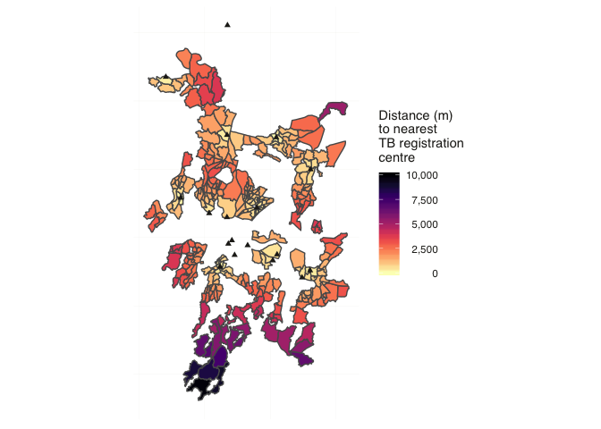<!-- -->

```r
ggsave(file="distance_to_clinic.pdf", width=6, height=6, dpi=300, 
       path = here("figures"))
```


<br>

##9. Male to female adult ratio


```r
g6 <- ggplot() +
  geom_sf(data = dat, aes(fill = m_f_adult_ratio)) +
  geom_sf(data=clinics, shape=17, colour="#22211d") +
  map_light() +
  scale_fill_viridis(option = "magma", direction = -1,
                     name = expression ("Adult\nMale:Female\nratio"),
                     labels=comma) +
  labs(x = NULL, 
       y = NULL) +
  theme(legend.text.align = 1)

g6
```

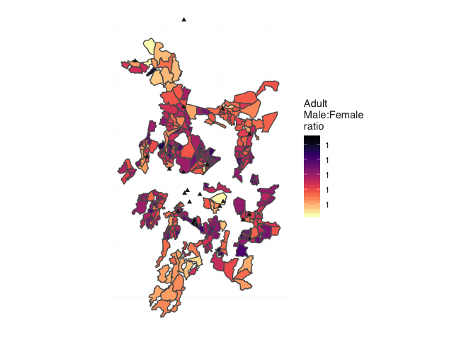<!-- -->

```r
ggsave(file="m_f_ratio.pdf", width=6, height=6, dpi=300, 
       path = here("figures"))
```

<br>

##10. Percentage of HSA cluster population who is adult


```r
g7 <- ggplot() +
  geom_sf(data = dat, aes(fill = prop_adults)) +
  geom_sf(data=clinics, shape=17, colour="#22211d") +
  map_light() +
  scale_fill_viridis(option = "magma", direction = -1,
                     name = expression ("Percent\naged\n15 years\nor older"),
                     labels=comma) +
  labs(x = NULL, 
       y = NULL) +
  theme(legend.text.align = 1)

g7
```

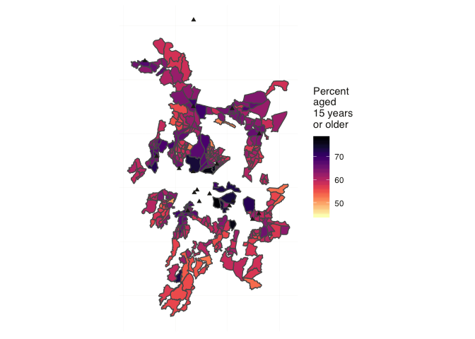<!-- -->

```r
ggsave(file="prop_adults.pdf", width=6, height=6, dpi=300, 
       path = here("figures"))
```

<br>

##11. Sputum smear positive to negative ratio.


```r
#Add in a term for ratio of smearpositive to smearnegative cases

dat <- dat %>%
  mutate(smr_ratio = n_smearpos_cases/(n_cases-n_smearpos_cases))

dat$smr_ratio[is.nan(dat$smr_ratio)] <- 1
dat$smr_ratio[is.infinite(dat$smr_ratio)] <- 1


g8 <- ggplot() +
  geom_sf(data = dat, aes(fill = smr_ratio)) +
  geom_sf(data=clinics, shape=17, colour="#22211d") +
  map_light() +
  scale_fill_viridis(option = "magma", direction = -1,
                     name = expression ("Smr +ve:-ve\nratio"),
                     labels=comma) +
  labs(x = NULL, 
       y = NULL) +
  theme(legend.text.align = 1)

g8
```

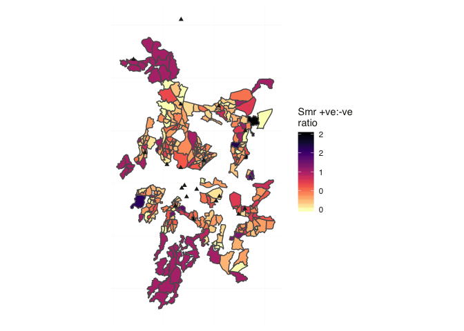<!-- -->

```r
ggsave(file="smr_pos_neg.pdf", width=6, height=6, dpi=300, 
       path = here("figures"))
```

```
## Warning in grid.Call(C_textBounds, as.graphicsAnnot(x$label), x$x, x$y, :
## font metrics unknown for character 0xa

## Warning in grid.Call(C_textBounds, as.graphicsAnnot(x$label), x$x, x$y, :
## font metrics unknown for character 0xa

## Warning in grid.Call(C_textBounds, as.graphicsAnnot(x$label), x$x, x$y, :
## font metrics unknown for character 0xa

## Warning in grid.Call(C_textBounds, as.graphicsAnnot(x$label), x$x, x$y, :
## font metrics unknown for character 0xa

## Warning in grid.Call(C_textBounds, as.graphicsAnnot(x$label), x$x, x$y, :
## font metrics unknown for character 0xa

## Warning in grid.Call(C_textBounds, as.graphicsAnnot(x$label), x$x, x$y, :
## font metrics unknown for character 0xa

## Warning in grid.Call(C_textBounds, as.graphicsAnnot(x$label), x$x, x$y, :
## font metrics unknown for character 0xa

## Warning in grid.Call(C_textBounds, as.graphicsAnnot(x$label), x$x, x$y, :
## font metrics unknown for character 0xa

## Warning in grid.Call(C_textBounds, as.graphicsAnnot(x$label), x$x, x$y, :
## font metrics unknown for character 0xa

## Warning in grid.Call(C_textBounds, as.graphicsAnnot(x$label), x$x, x$y, :
## font metrics unknown for character 0xa

## Warning in grid.Call(C_textBounds, as.graphicsAnnot(x$label), x$x, x$y, :
## font metrics unknown for character 0xa

## Warning in grid.Call(C_textBounds, as.graphicsAnnot(x$label), x$x, x$y, :
## font metrics unknown for character 0xa

## Warning in grid.Call(C_textBounds, as.graphicsAnnot(x$label), x$x, x$y, :
## font metrics unknown for character 0xa

## Warning in grid.Call(C_textBounds, as.graphicsAnnot(x$label), x$x, x$y, :
## font metrics unknown for character 0xa

## Warning in grid.Call(C_textBounds, as.graphicsAnnot(x$label), x$x, x$y, :
## font metrics unknown for character 0xa

## Warning in grid.Call(C_textBounds, as.graphicsAnnot(x$label), x$x, x$y, :
## font metrics unknown for character 0xa

## Warning in grid.Call(C_textBounds, as.graphicsAnnot(x$label), x$x, x$y, :
## font metrics unknown for character 0xa

## Warning in grid.Call(C_textBounds, as.graphicsAnnot(x$label), x$x, x$y, :
## font metrics unknown for character 0xa

## Warning in grid.Call(C_textBounds, as.graphicsAnnot(x$label), x$x, x$y, :
## font metrics unknown for character 0xa

## Warning in grid.Call(C_textBounds, as.graphicsAnnot(x$label), x$x, x$y, :
## font metrics unknown for character 0xa

## Warning in grid.Call(C_textBounds, as.graphicsAnnot(x$label), x$x, x$y, :
## font metrics unknown for character 0xa

## Warning in grid.Call(C_textBounds, as.graphicsAnnot(x$label), x$x, x$y, :
## font metrics unknown for character 0xa

## Warning in grid.Call(C_textBounds, as.graphicsAnnot(x$label), x$x, x$y, :
## font metrics unknown for character 0xa

## Warning in grid.Call(C_textBounds, as.graphicsAnnot(x$label), x$x, x$y, :
## font metrics unknown for character 0xa

## Warning in grid.Call(C_textBounds, as.graphicsAnnot(x$label), x$x, x$y, :
## font metrics unknown for character 0xa

## Warning in grid.Call(C_textBounds, as.graphicsAnnot(x$label), x$x, x$y, :
## font metrics unknown for character 0xa

## Warning in grid.Call(C_textBounds, as.graphicsAnnot(x$label), x$x, x$y, :
## font metrics unknown for character 0xa

## Warning in grid.Call(C_textBounds, as.graphicsAnnot(x$label), x$x, x$y, :
## font metrics unknown for character 0xa

## Warning in grid.Call(C_textBounds, as.graphicsAnnot(x$label), x$x, x$y, :
## font metrics unknown for character 0xa

## Warning in grid.Call(C_textBounds, as.graphicsAnnot(x$label), x$x, x$y, :
## font metrics unknown for character 0xa

## Warning in grid.Call(C_textBounds, as.graphicsAnnot(x$label), x$x, x$y, :
## font metrics unknown for character 0xa

## Warning in grid.Call(C_textBounds, as.graphicsAnnot(x$label), x$x, x$y, :
## font metrics unknown for character 0xa

## Warning in grid.Call(C_textBounds, as.graphicsAnnot(x$label), x$x, x$y, :
## font metrics unknown for character 0xa

## Warning in grid.Call(C_textBounds, as.graphicsAnnot(x$label), x$x, x$y, :
## font metrics unknown for character 0xa

## Warning in grid.Call(C_textBounds, as.graphicsAnnot(x$label), x$x, x$y, :
## font metrics unknown for character 0xa

## Warning in grid.Call(C_textBounds, as.graphicsAnnot(x$label), x$x, x$y, :
## font metrics unknown for character 0xa

## Warning in grid.Call(C_textBounds, as.graphicsAnnot(x$label), x$x, x$y, :
## font metrics unknown for character 0xa

## Warning in grid.Call(C_textBounds, as.graphicsAnnot(x$label), x$x, x$y, :
## font metrics unknown for character 0xa

## Warning in grid.Call(C_textBounds, as.graphicsAnnot(x$label), x$x, x$y, :
## font metrics unknown for character 0xa

## Warning in grid.Call(C_textBounds, as.graphicsAnnot(x$label), x$x, x$y, :
## font metrics unknown for character 0xa

## Warning in grid.Call(C_textBounds, as.graphicsAnnot(x$label), x$x, x$y, :
## font metrics unknown for character 0xa

## Warning in grid.Call(C_textBounds, as.graphicsAnnot(x$label), x$x, x$y, :
## font metrics unknown for character 0xa

## Warning in grid.Call(C_textBounds, as.graphicsAnnot(x$label), x$x, x$y, :
## font metrics unknown for character 0xa

## Warning in grid.Call(C_textBounds, as.graphicsAnnot(x$label), x$x, x$y, :
## font metrics unknown for character 0xa

## Warning in grid.Call(C_textBounds, as.graphicsAnnot(x$label), x$x, x$y, :
## font metrics unknown for character 0xa

## Warning in grid.Call(C_textBounds, as.graphicsAnnot(x$label), x$x, x$y, :
## font metrics unknown for character 0xa

## Warning in grid.Call(C_textBounds, as.graphicsAnnot(x$label), x$x, x$y, :
## font metrics unknown for character 0xa

## Warning in grid.Call(C_textBounds, as.graphicsAnnot(x$label), x$x, x$y, :
## font metrics unknown for character 0xa
```

```
## Warning in grid.Call.graphics(C_text, as.graphicsAnnot(x$label), x$x,
## x$y, : font metrics unknown for character 0xa

## Warning in grid.Call.graphics(C_text, as.graphicsAnnot(x$label), x$x,
## x$y, : font metrics unknown for character 0xa
```

<br>

##12. Supplemental Figure 1

Join all the descriptive figures together to produce one figure


```r
plot_grid(g1, g2, g3, g4, g5, g6, g7, g8,
          labels = c("A", "B", "C", "D", "E", "F", "G", "H"),
          label_fontfamily = "Helvetica")
```

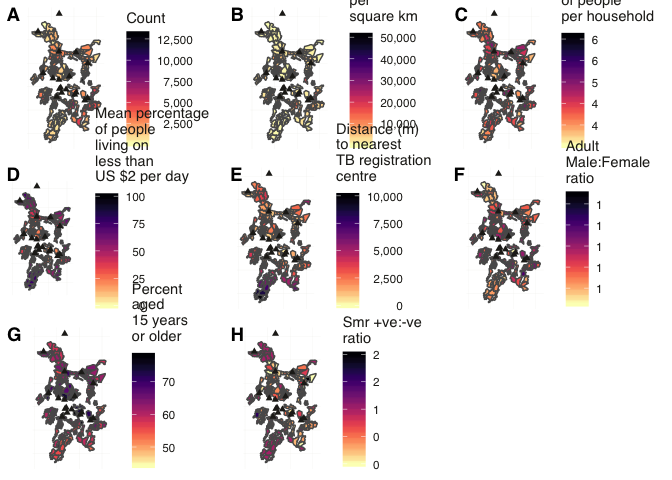<!-- -->

```r
ggsave(file="S1_Fig.pdf", width=12, height=12, dpi=300, 
       path = here("figures"))
```

<br>

##13. Correlation between variables.


```r
corrs <- dat %>%
  st_set_geometry(., NULL) %>%
  dplyr::select(total, mean_people_per_hh, popdens, m_f_adult_ratio,
         prop_adults, mwi11povcons200, clinic_distance, smr_ratio)
   

pairs(corrs)
```

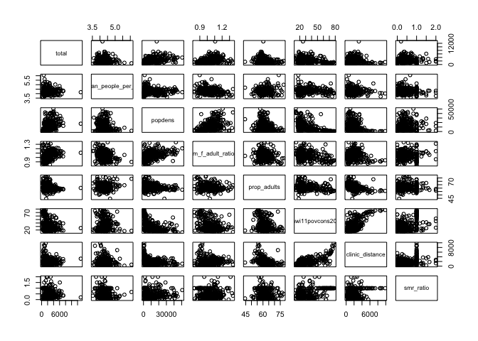<!-- -->


<br>

##14. Table 1: Characteristics of TB cases

Compare characteristics of cases located within and outside of HSA catchment areas.


```r
data("x01_epal2", package="BlantyreTBEpi")

x01_epal2$year <- fct_drop(x01_epal2$year)


table1 <- tableby(resident ~ year + sex + age + tbclass + smearstatus + hivstatus + lab_smear + lab_culture + lab_id + any_micro_confirm, data = x01_epal2)

summary(table1)
```


|                                                     | HSA resident (N=3723) | Non HSA resident (N=2354) | Total (N=6077)  | p value|
|:----------------------------------------------------|:---------------------:|:-------------------------:|:---------------:|-------:|
|**year**                                             |                       |                           |                 |   0.008|
|&nbsp;&nbsp;&nbsp;2015                               |      994 (26.7%)      |        666 (28.3%)        |  1660 (27.3%)   |        |
|&nbsp;&nbsp;&nbsp;2016                               |     1314 (35.3%)      |        886 (37.6%)        |  2200 (36.2%)   |        |
|&nbsp;&nbsp;&nbsp;2017                               |     1415 (38.0%)      |        802 (34.1%)        |  2217 (36.5%)   |        |
|**sex**                                              |                       |                           |                 | < 0.001|
|&nbsp;&nbsp;&nbsp;N-Miss                             |           0           |             3             |        3        |        |
|&nbsp;&nbsp;&nbsp;Female                             |     1368 (36.7%)      |        985 (41.9%)        |  2353 (38.7%)   |        |
|&nbsp;&nbsp;&nbsp;Male                               |     2355 (63.3%)      |       1366 (58.1%)        |  3721 (61.3%)   |        |
|**age**                                              |                       |                           |                 |   0.002|
|&nbsp;&nbsp;&nbsp;Mean (SD)                          |    34.891 (13.639)    |      36.098 (16.265)      | 35.359 (14.722) |        |
|&nbsp;&nbsp;&nbsp;Range                              |    0.000 - 89.000     |      0.000 - 89.000       | 0.000 - 89.000  |        |
|**tbclass**                                          |                       |                           |                 | < 0.001|
|&nbsp;&nbsp;&nbsp;N-Miss                             |          31           |            90             |       121       |        |
|&nbsp;&nbsp;&nbsp;Extrapulmonary TB                  |     1416 (38.4%)      |       1027 (45.4%)        |  2443 (41.0%)   |        |
|&nbsp;&nbsp;&nbsp;Pulmonary TB                       |     2276 (61.6%)      |       1237 (54.6%)        |  3513 (59.0%)   |        |
|**smearstatus**                                      |                       |                           |                 |   0.005|
|&nbsp;&nbsp;&nbsp;N-Miss                             |         2087          |           1437            |      3524       |        |
|&nbsp;&nbsp;&nbsp;Negative                           |      618 (37.8%)      |        399 (43.5%)        |  1017 (39.8%)   |        |
|&nbsp;&nbsp;&nbsp;Positive                           |     1018 (62.2%)      |        518 (56.5%)        |  1536 (60.2%)   |        |
|**hivstatus**                                        |                       |                           |                 |   0.007|
|&nbsp;&nbsp;&nbsp;N-Miss                             |           1           |            75             |       76        |        |
|&nbsp;&nbsp;&nbsp;HIV negative                       |     1146 (30.8%)      |        786 (34.5%)        |  1932 (32.2%)   |        |
|&nbsp;&nbsp;&nbsp;HIV positive                       |     2489 (66.9%)      |       1433 (62.9%)        |  3922 (65.4%)   |        |
|&nbsp;&nbsp;&nbsp;Not done                           |       87 (2.3%)       |         60 (2.6%)         |   147 (2.4%)    |        |
|**lab_smear**                                        |                       |                           |                 | < 0.001|
|&nbsp;&nbsp;&nbsp;N-Miss                             |          911          |            698            |      1609       |        |
|&nbsp;&nbsp;&nbsp;Scanty positive                    |       18 (0.6%)       |         5 (0.3%)          |    23 (0.5%)    |        |
|&nbsp;&nbsp;&nbsp;Smear-negative                     |     1524 (54.2%)      |       1000 (60.4%)        |  2524 (56.5%)   |        |
|&nbsp;&nbsp;&nbsp;Smear-positive                     |     1270 (45.2%)      |        651 (39.3%)        |  1921 (43.0%)   |        |
|**lab_culture**                                      |                       |                           |                 | < 0.001|
|&nbsp;&nbsp;&nbsp;N-Miss                             |         1013          |            758            |      1771       |        |
|&nbsp;&nbsp;&nbsp;Culture-negative                   |     1113 (41.1%)      |        808 (50.6%)        |  1921 (44.6%)   |        |
|&nbsp;&nbsp;&nbsp;Culture-positive                   |     1597 (58.9%)      |        788 (49.4%)        |  2385 (55.4%)   |        |
|**lab_id**                                           |                       |                           |                 |   1.000|
|&nbsp;&nbsp;&nbsp;N-Miss                             |         2230          |           1625            |      3855       |        |
|&nbsp;&nbsp;&nbsp;Culture-positive MTB               |     1493 (100.0%)     |       729 (100.0%)        |  2222 (100.0%)  |        |
|**any_micro_confirm**                                |                       |                           |                 | < 0.001|
|&nbsp;&nbsp;&nbsp;Microbiologically-confirmed TB     |     1700 (45.7%)      |        845 (35.9%)        |  2545 (41.9%)   |        |
|&nbsp;&nbsp;&nbsp;Not microbiologically-confirmed TB |     2023 (54.3%)      |       1509 (64.1%)        |  3532 (58.1%)   |        |


<br>
 
##15. Figure 2: TB case notification rates
 
Plot overall TB case notification rates.


```r
data("cnrs", package="BlantyreTBEpi")

cnr1 <- ggplot() +
  geom_sf(data=dat) +
  geom_sf(data=cnrs, aes(fill=cnr)) + 
  geom_sf(data=clinics, shape=17, colour="#22211d") +
  map_light() +
  scale_fill_distiller(palette = "Spectral",
                     name = "",
                     labels=comma,
                     limits = c(0,999)) +
  labs(x = NULL, 
       y = NULL) +
  facet_grid(~year, drop = FALSE) +
  theme(panel.background = element_rect(fill = "white", color = "#22211d" )) 

cnr1
```

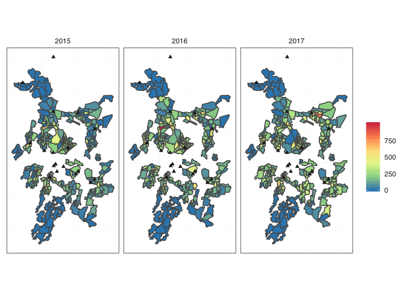<!-- -->

```r
ggsave(file="cnrs.pdf", width=12, height=6, dpi=300, 
       path = here("figures"))
```

Now plot microbiologically-confirmed TB case notification rate


```r
data("cnrs", package="BlantyreTBEpi")

cnr2 <- ggplot() +
  geom_sf(data=dat) +
  geom_sf(data=cnrs, aes(fill=micro_cnr)) + 
  geom_sf(data=clinics, shape=17, colour="#22211d") +
  map_light() +
  scale_fill_distiller(palette = "Spectral",
                     name = "",
                     labels=comma,
                     limits = c(0,500)) +
  labs(x = NULL, 
       y = NULL) +
  facet_grid(~year, drop = FALSE) +
  theme(panel.background = element_rect(fill = "white", color = "#22211d" ))

cnr2
```

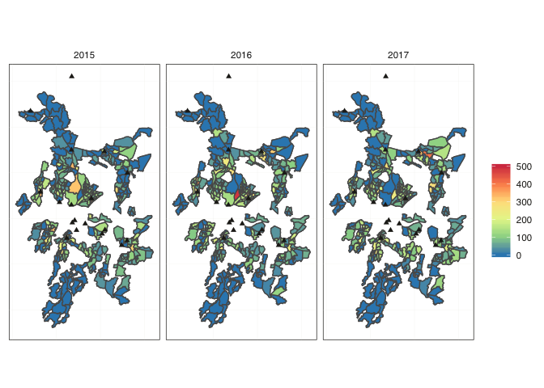<!-- -->

```r
ggsave(file="micro_cnrs.pdf", width=12, height=6, dpi=300, 
       path = here("figures"))
```


```r
plot_grid(cnr1, cnr2, labels = c("A", "B"), ncol = 1,
          label_fontfamily = "Helvetica")
```

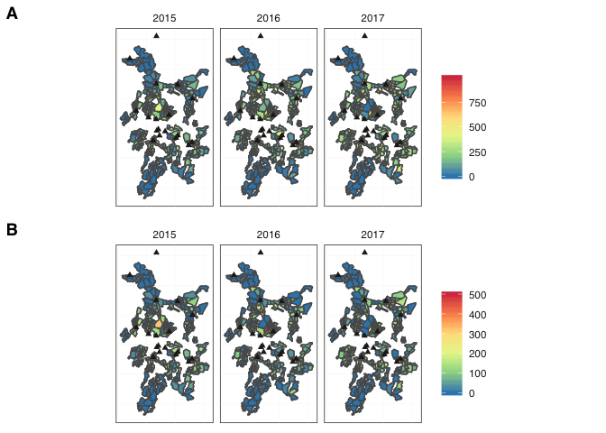<!-- -->

```r
ggsave(file="Figure2.pdf", width=10, height=8, dpi=300, 
       path = here("figures"))
```

<br>

##16. Spatial modelling

Make the spatial correlation matrices.


```r
#Make the adjacency matrix
#First find the centroids
centroids_sf <- st_centroid(st_geometry(dat), of_largest_polygon=TRUE)
zm <- class(st_geometry(centroids_sf)[[1]])[1]
if (zm %in% c("XYM", "XYZM"))
  centroids_sf <- st_zm(centroids_sf, drop=TRUE, what="ZM")
if (zm %in% c("XYZ"))
  centroids_sf <- st_zm(centroids_sf, drop=TRUE, what="ZM")

coords_sf <- st_coordinates(centroids_sf)

neigh1 <- knn2nb(knearneigh(coords_sf, k=1))
neigh2 <- knn2nb(knearneigh(coords_sf, k=2))
neigh3 <- knn2nb(knearneigh(coords_sf, k=3))
neigh4 <- knn2nb(knearneigh(coords_sf, k=4))
neigh5 <- knn2nb(knearneigh(coords_sf, k=5))
neigh6 <- knn2nb(knearneigh(coords_sf, k=6))


path <- paste(here("figures"), "S2_fig.pdf", sep="/")
pdf(path)

par(mfrow=c(2,3), mar=c(1,1,1,1))
plot.nb(neigh1, coords_sf, col="#036564", points=FALSE)
title(main="k=1", cex=2)
plot.nb(neigh2, coords_sf, col="#036564", points=FALSE)
title(main="k=2", cex=2)
plot.nb(neigh3, coords_sf, col="#036564", points=FALSE)
title(main="k=3", cex=2)
plot.nb(neigh4, coords_sf, col="#036564", points=FALSE)
title(main="k=4", cex=2)
plot.nb(neigh5, coords_sf, col="#036564", points=FALSE)
title(main="k=5", cex=2)
plot.nb(neigh6, coords_sf, col="#036564", points=FALSE)
title(main="k=6", cex=2)

dev.off()
```

```
## quartz_off_screen 
##                 2
```

```r
dat$hsa_area <- factor (1:nrow (dat))

#Create the neighbourhood matrices for each model
w1 <- nb2mat(make.sym.nb(neigh1), style="B")
rownames(w1) <- as.character (1:nrow (dat))

w2 <- nb2mat(make.sym.nb(neigh2), style="B")
rownames(w2) <- as.character (1:nrow (dat))

w3 <- nb2mat(make.sym.nb(neigh3), style="B")
rownames(w3) <- as.character (1:nrow (dat))

w4 <- nb2mat(make.sym.nb(neigh4), style="B")
rownames(w4) <- as.character (1:nrow (dat))

w5 <- nb2mat(make.sym.nb(neigh5), style="B")
rownames(w5) <- as.character (1:nrow (dat))

w6 <- nb2mat(make.sym.nb(neigh6), style="B")
rownames(w6) <- as.character (1:nrow (dat))
```

Take logarithm of some values


```r
dat <- dat %>%
  mutate(log_total = log10(total))

dat <- dat %>%
  mutate(log_popdens = log10(popdens))

dat <- dat %>%
  mutate(log_clinic_distance = log10(clinic_distance))
```


Run all of the models, varying spatial autocorration prior


```r
prior <- c(prior_string("normal(0,10)", class="b"),
           prior_(~normal(0,10), class= ~Intercept))

all_0 <- brm(bf(n_cases ~
          mean_people_per_hh +
          log_popdens +
          log_clinic_distance +
          mwi11povcons200 +
          m_f_adult_ratio +
          prop_adults +
          smr_ratio +
          offset(log(total))),
          data=dat, 
          family='poisson',
          prior = prior,
          iter=4000, warmup=1000,
          chains=3,
          seed=1234,
          control=list(adapt_delta=0.95))
```

```
## Compiling the C++ model
```

```
## Start sampling
```

```
## 
## SAMPLING FOR MODEL 'poisson brms-model' NOW (CHAIN 1).
## 
## Gradient evaluation took 8.2e-05 seconds
## 1000 transitions using 10 leapfrog steps per transition would take 0.82 seconds.
## Adjust your expectations accordingly!
## 
## 
## Iteration:    1 / 4000 [  0%]  (Warmup)
## Iteration:  400 / 4000 [ 10%]  (Warmup)
## Iteration:  800 / 4000 [ 20%]  (Warmup)
## Iteration: 1001 / 4000 [ 25%]  (Sampling)
## Iteration: 1400 / 4000 [ 35%]  (Sampling)
## Iteration: 1800 / 4000 [ 45%]  (Sampling)
## Iteration: 2200 / 4000 [ 55%]  (Sampling)
## Iteration: 2600 / 4000 [ 65%]  (Sampling)
## Iteration: 3000 / 4000 [ 75%]  (Sampling)
## Iteration: 3400 / 4000 [ 85%]  (Sampling)
## Iteration: 3800 / 4000 [ 95%]  (Sampling)
## Iteration: 4000 / 4000 [100%]  (Sampling)
## 
##  Elapsed Time: 1.74325 seconds (Warm-up)
##                2.55075 seconds (Sampling)
##                4.294 seconds (Total)
## 
## 
## SAMPLING FOR MODEL 'poisson brms-model' NOW (CHAIN 2).
## 
## Gradient evaluation took 6e-05 seconds
## 1000 transitions using 10 leapfrog steps per transition would take 0.6 seconds.
## Adjust your expectations accordingly!
## 
## 
## Iteration:    1 / 4000 [  0%]  (Warmup)
## Iteration:  400 / 4000 [ 10%]  (Warmup)
## Iteration:  800 / 4000 [ 20%]  (Warmup)
## Iteration: 1001 / 4000 [ 25%]  (Sampling)
## Iteration: 1400 / 4000 [ 35%]  (Sampling)
## Iteration: 1800 / 4000 [ 45%]  (Sampling)
## Iteration: 2200 / 4000 [ 55%]  (Sampling)
## Iteration: 2600 / 4000 [ 65%]  (Sampling)
## Iteration: 3000 / 4000 [ 75%]  (Sampling)
## Iteration: 3400 / 4000 [ 85%]  (Sampling)
## Iteration: 3800 / 4000 [ 95%]  (Sampling)
## Iteration: 4000 / 4000 [100%]  (Sampling)
## 
##  Elapsed Time: 3.12052 seconds (Warm-up)
##                2.35256 seconds (Sampling)
##                5.47308 seconds (Total)
## 
## 
## SAMPLING FOR MODEL 'poisson brms-model' NOW (CHAIN 3).
## 
## Gradient evaluation took 5.4e-05 seconds
## 1000 transitions using 10 leapfrog steps per transition would take 0.54 seconds.
## Adjust your expectations accordingly!
## 
## 
## Iteration:    1 / 4000 [  0%]  (Warmup)
## Iteration:  400 / 4000 [ 10%]  (Warmup)
## Iteration:  800 / 4000 [ 20%]  (Warmup)
## Iteration: 1001 / 4000 [ 25%]  (Sampling)
## Iteration: 1400 / 4000 [ 35%]  (Sampling)
## Iteration: 1800 / 4000 [ 45%]  (Sampling)
## Iteration: 2200 / 4000 [ 55%]  (Sampling)
## Iteration: 2600 / 4000 [ 65%]  (Sampling)
## Iteration: 3000 / 4000 [ 75%]  (Sampling)
## Iteration: 3400 / 4000 [ 85%]  (Sampling)
## Iteration: 3800 / 4000 [ 95%]  (Sampling)
## Iteration: 4000 / 4000 [100%]  (Sampling)
## 
##  Elapsed Time: 2.00308 seconds (Warm-up)
##                2.73956 seconds (Sampling)
##                4.74264 seconds (Total)
```

```r
all_1 <- brm(bf(n_cases ~
          mean_people_per_hh +
          log_popdens +
          log_clinic_distance +
          mwi11povcons200 +
          m_f_adult_ratio +
          prop_adults +
          smr_ratio +
          offset(log(total))),
          data=dat, 
          family='poisson',
          prior = prior,
          autocor=cor_car(w2, ~ 1 | c02hsaid1),
          iter=4000, warmup=1000,
          chains=3,
          seed=1234,
          control=list(adapt_delta=0.95))
```

```
## Compiling the C++ model
## Start sampling
```

```
## 
## SAMPLING FOR MODEL 'poisson brms-model' NOW (CHAIN 1).
## 
## Gradient evaluation took 0.000179 seconds
## 1000 transitions using 10 leapfrog steps per transition would take 1.79 seconds.
## Adjust your expectations accordingly!
## 
## 
## Iteration:    1 / 4000 [  0%]  (Warmup)
## Iteration:  400 / 4000 [ 10%]  (Warmup)
## Iteration:  800 / 4000 [ 20%]  (Warmup)
## Iteration: 1001 / 4000 [ 25%]  (Sampling)
## Iteration: 1400 / 4000 [ 35%]  (Sampling)
## Iteration: 1800 / 4000 [ 45%]  (Sampling)
## Iteration: 2200 / 4000 [ 55%]  (Sampling)
## Iteration: 2600 / 4000 [ 65%]  (Sampling)
## Iteration: 3000 / 4000 [ 75%]  (Sampling)
## Iteration: 3400 / 4000 [ 85%]  (Sampling)
## Iteration: 3800 / 4000 [ 95%]  (Sampling)
## Iteration: 4000 / 4000 [100%]  (Sampling)
## 
##  Elapsed Time: 10.8606 seconds (Warm-up)
##                16.8343 seconds (Sampling)
##                27.6949 seconds (Total)
## 
## 
## SAMPLING FOR MODEL 'poisson brms-model' NOW (CHAIN 2).
## 
## Gradient evaluation took 0.000119 seconds
## 1000 transitions using 10 leapfrog steps per transition would take 1.19 seconds.
## Adjust your expectations accordingly!
## 
## 
## Iteration:    1 / 4000 [  0%]  (Warmup)
## Iteration:  400 / 4000 [ 10%]  (Warmup)
## Iteration:  800 / 4000 [ 20%]  (Warmup)
## Iteration: 1001 / 4000 [ 25%]  (Sampling)
## Iteration: 1400 / 4000 [ 35%]  (Sampling)
## Iteration: 1800 / 4000 [ 45%]  (Sampling)
## Iteration: 2200 / 4000 [ 55%]  (Sampling)
## Iteration: 2600 / 4000 [ 65%]  (Sampling)
## Iteration: 3000 / 4000 [ 75%]  (Sampling)
## Iteration: 3400 / 4000 [ 85%]  (Sampling)
## Iteration: 3800 / 4000 [ 95%]  (Sampling)
## Iteration: 4000 / 4000 [100%]  (Sampling)
## 
##  Elapsed Time: 29.1396 seconds (Warm-up)
##                11.6626 seconds (Sampling)
##                40.8021 seconds (Total)
## 
## 
## SAMPLING FOR MODEL 'poisson brms-model' NOW (CHAIN 3).
## 
## Gradient evaluation took 0.000168 seconds
## 1000 transitions using 10 leapfrog steps per transition would take 1.68 seconds.
## Adjust your expectations accordingly!
## 
## 
## Iteration:    1 / 4000 [  0%]  (Warmup)
## Iteration:  400 / 4000 [ 10%]  (Warmup)
## Iteration:  800 / 4000 [ 20%]  (Warmup)
## Iteration: 1001 / 4000 [ 25%]  (Sampling)
## Iteration: 1400 / 4000 [ 35%]  (Sampling)
## Iteration: 1800 / 4000 [ 45%]  (Sampling)
## Iteration: 2200 / 4000 [ 55%]  (Sampling)
## Iteration: 2600 / 4000 [ 65%]  (Sampling)
## Iteration: 3000 / 4000 [ 75%]  (Sampling)
## Iteration: 3400 / 4000 [ 85%]  (Sampling)
## Iteration: 3800 / 4000 [ 95%]  (Sampling)
## Iteration: 4000 / 4000 [100%]  (Sampling)
## 
##  Elapsed Time: 10.5642 seconds (Warm-up)
##                10.7537 seconds (Sampling)
##                21.3179 seconds (Total)
```

```r
all_2 <- brm(bf(n_cases ~
          mean_people_per_hh +
          log_popdens +
          log_clinic_distance +
          mwi11povcons200 +
          m_f_adult_ratio +
          prop_adults +
          smr_ratio +
          offset(log(total))),
          data=dat, 
          family='poisson',
          prior = prior,
          autocor=cor_car(w2, ~ 1 | c02hsaid1),
          iter=4000, warmup=1000,
          chains=3,
          seed=1234,
          control=list(adapt_delta=0.95))
```

```
## Compiling the C++ model
## Start sampling
```

```
## 
## SAMPLING FOR MODEL 'poisson brms-model' NOW (CHAIN 1).
## 
## Gradient evaluation took 0.000166 seconds
## 1000 transitions using 10 leapfrog steps per transition would take 1.66 seconds.
## Adjust your expectations accordingly!
## 
## 
## Iteration:    1 / 4000 [  0%]  (Warmup)
## Iteration:  400 / 4000 [ 10%]  (Warmup)
## Iteration:  800 / 4000 [ 20%]  (Warmup)
## Iteration: 1001 / 4000 [ 25%]  (Sampling)
## Iteration: 1400 / 4000 [ 35%]  (Sampling)
## Iteration: 1800 / 4000 [ 45%]  (Sampling)
## Iteration: 2200 / 4000 [ 55%]  (Sampling)
## Iteration: 2600 / 4000 [ 65%]  (Sampling)
## Iteration: 3000 / 4000 [ 75%]  (Sampling)
## Iteration: 3400 / 4000 [ 85%]  (Sampling)
## Iteration: 3800 / 4000 [ 95%]  (Sampling)
## Iteration: 4000 / 4000 [100%]  (Sampling)
## 
##  Elapsed Time: 10.3519 seconds (Warm-up)
##                17.2822 seconds (Sampling)
##                27.6341 seconds (Total)
## 
## 
## SAMPLING FOR MODEL 'poisson brms-model' NOW (CHAIN 2).
## 
## Gradient evaluation took 0.000137 seconds
## 1000 transitions using 10 leapfrog steps per transition would take 1.37 seconds.
## Adjust your expectations accordingly!
## 
## 
## Iteration:    1 / 4000 [  0%]  (Warmup)
## Iteration:  400 / 4000 [ 10%]  (Warmup)
## Iteration:  800 / 4000 [ 20%]  (Warmup)
## Iteration: 1001 / 4000 [ 25%]  (Sampling)
## Iteration: 1400 / 4000 [ 35%]  (Sampling)
## Iteration: 1800 / 4000 [ 45%]  (Sampling)
## Iteration: 2200 / 4000 [ 55%]  (Sampling)
## Iteration: 2600 / 4000 [ 65%]  (Sampling)
## Iteration: 3000 / 4000 [ 75%]  (Sampling)
## Iteration: 3400 / 4000 [ 85%]  (Sampling)
## Iteration: 3800 / 4000 [ 95%]  (Sampling)
## Iteration: 4000 / 4000 [100%]  (Sampling)
## 
##  Elapsed Time: 29.7189 seconds (Warm-up)
##                10.9488 seconds (Sampling)
##                40.6677 seconds (Total)
## 
## 
## SAMPLING FOR MODEL 'poisson brms-model' NOW (CHAIN 3).
## 
## Gradient evaluation took 0.000168 seconds
## 1000 transitions using 10 leapfrog steps per transition would take 1.68 seconds.
## Adjust your expectations accordingly!
## 
## 
## Iteration:    1 / 4000 [  0%]  (Warmup)
## Iteration:  400 / 4000 [ 10%]  (Warmup)
## Iteration:  800 / 4000 [ 20%]  (Warmup)
## Iteration: 1001 / 4000 [ 25%]  (Sampling)
## Iteration: 1400 / 4000 [ 35%]  (Sampling)
## Iteration: 1800 / 4000 [ 45%]  (Sampling)
## Iteration: 2200 / 4000 [ 55%]  (Sampling)
## Iteration: 2600 / 4000 [ 65%]  (Sampling)
## Iteration: 3000 / 4000 [ 75%]  (Sampling)
## Iteration: 3400 / 4000 [ 85%]  (Sampling)
## Iteration: 3800 / 4000 [ 95%]  (Sampling)
## Iteration: 4000 / 4000 [100%]  (Sampling)
## 
##  Elapsed Time: 10.216 seconds (Warm-up)
##                10.645 seconds (Sampling)
##                20.8609 seconds (Total)
```

```r
all_3 <- brm(bf(n_cases ~
          mean_people_per_hh +
          log_popdens +
          log_clinic_distance +
          mwi11povcons200 +
          m_f_adult_ratio +
          prop_adults +
          smr_ratio +
          offset(log(total))),
          data=dat, 
          family='poisson',
          prior = prior,
          autocor=cor_car(w3, ~ 1 | c02hsaid1),
          iter=4000, warmup=1000,
          chains=3,
          seed=1234,
          control=list(adapt_delta=0.95))
```

```
## Compiling the C++ model
## Start sampling
```

```
## 
## SAMPLING FOR MODEL 'poisson brms-model' NOW (CHAIN 1).
## 
## Gradient evaluation took 0.000194 seconds
## 1000 transitions using 10 leapfrog steps per transition would take 1.94 seconds.
## Adjust your expectations accordingly!
## 
## 
## Iteration:    1 / 4000 [  0%]  (Warmup)
## Iteration:  400 / 4000 [ 10%]  (Warmup)
## Iteration:  800 / 4000 [ 20%]  (Warmup)
## Iteration: 1001 / 4000 [ 25%]  (Sampling)
## Iteration: 1400 / 4000 [ 35%]  (Sampling)
## Iteration: 1800 / 4000 [ 45%]  (Sampling)
## Iteration: 2200 / 4000 [ 55%]  (Sampling)
## Iteration: 2600 / 4000 [ 65%]  (Sampling)
## Iteration: 3000 / 4000 [ 75%]  (Sampling)
## Iteration: 3400 / 4000 [ 85%]  (Sampling)
## Iteration: 3800 / 4000 [ 95%]  (Sampling)
## Iteration: 4000 / 4000 [100%]  (Sampling)
## 
##  Elapsed Time: 9.97249 seconds (Warm-up)
##                11.392 seconds (Sampling)
##                21.3645 seconds (Total)
## 
## 
## SAMPLING FOR MODEL 'poisson brms-model' NOW (CHAIN 2).
## 
## Gradient evaluation took 0.000117 seconds
## 1000 transitions using 10 leapfrog steps per transition would take 1.17 seconds.
## Adjust your expectations accordingly!
## 
## 
## Iteration:    1 / 4000 [  0%]  (Warmup)
## Iteration:  400 / 4000 [ 10%]  (Warmup)
## Iteration:  800 / 4000 [ 20%]  (Warmup)
## Iteration: 1001 / 4000 [ 25%]  (Sampling)
## Iteration: 1400 / 4000 [ 35%]  (Sampling)
## Iteration: 1800 / 4000 [ 45%]  (Sampling)
## Iteration: 2200 / 4000 [ 55%]  (Sampling)
## Iteration: 2600 / 4000 [ 65%]  (Sampling)
## Iteration: 3000 / 4000 [ 75%]  (Sampling)
## Iteration: 3400 / 4000 [ 85%]  (Sampling)
## Iteration: 3800 / 4000 [ 95%]  (Sampling)
## Iteration: 4000 / 4000 [100%]  (Sampling)
## 
##  Elapsed Time: 31.8648 seconds (Warm-up)
##                11.5132 seconds (Sampling)
##                43.378 seconds (Total)
## 
## 
## SAMPLING FOR MODEL 'poisson brms-model' NOW (CHAIN 3).
## 
## Gradient evaluation took 0.000132 seconds
## 1000 transitions using 10 leapfrog steps per transition would take 1.32 seconds.
## Adjust your expectations accordingly!
## 
## 
## Iteration:    1 / 4000 [  0%]  (Warmup)
## Iteration:  400 / 4000 [ 10%]  (Warmup)
## Iteration:  800 / 4000 [ 20%]  (Warmup)
## Iteration: 1001 / 4000 [ 25%]  (Sampling)
## Iteration: 1400 / 4000 [ 35%]  (Sampling)
## Iteration: 1800 / 4000 [ 45%]  (Sampling)
## Iteration: 2200 / 4000 [ 55%]  (Sampling)
## Iteration: 2600 / 4000 [ 65%]  (Sampling)
## Iteration: 3000 / 4000 [ 75%]  (Sampling)
## Iteration: 3400 / 4000 [ 85%]  (Sampling)
## Iteration: 3800 / 4000 [ 95%]  (Sampling)
## Iteration: 4000 / 4000 [100%]  (Sampling)
## 
##  Elapsed Time: 10.51 seconds (Warm-up)
##                11.4836 seconds (Sampling)
##                21.9936 seconds (Total)
```

```r
all_4 <- brm(bf(n_cases ~
          mean_people_per_hh +
          log_popdens +
          log_clinic_distance +
          mwi11povcons200 +
          m_f_adult_ratio +
          prop_adults +
          smr_ratio +
          offset(log(total))),
          data=dat, 
          family='poisson',
          prior = prior,
          autocor=cor_car(w4, ~ 1 | c02hsaid1),
          iter=4000, warmup=1000,
          chains=3,
          seed=1234,
          control=list(adapt_delta=0.95))
```

```
## Compiling the C++ model
## Start sampling
```

```
## 
## SAMPLING FOR MODEL 'poisson brms-model' NOW (CHAIN 1).
## 
## Gradient evaluation took 0.000363 seconds
## 1000 transitions using 10 leapfrog steps per transition would take 3.63 seconds.
## Adjust your expectations accordingly!
## 
## 
## Iteration:    1 / 4000 [  0%]  (Warmup)
## Iteration:  400 / 4000 [ 10%]  (Warmup)
## Iteration:  800 / 4000 [ 20%]  (Warmup)
## Iteration: 1001 / 4000 [ 25%]  (Sampling)
## Iteration: 1400 / 4000 [ 35%]  (Sampling)
## Iteration: 1800 / 4000 [ 45%]  (Sampling)
## Iteration: 2200 / 4000 [ 55%]  (Sampling)
## Iteration: 2600 / 4000 [ 65%]  (Sampling)
## Iteration: 3000 / 4000 [ 75%]  (Sampling)
## Iteration: 3400 / 4000 [ 85%]  (Sampling)
## Iteration: 3800 / 4000 [ 95%]  (Sampling)
## Iteration: 4000 / 4000 [100%]  (Sampling)
## 
##  Elapsed Time: 11.7532 seconds (Warm-up)
##                13.5198 seconds (Sampling)
##                25.273 seconds (Total)
## 
## 
## SAMPLING FOR MODEL 'poisson brms-model' NOW (CHAIN 2).
## 
## Gradient evaluation took 0.000123 seconds
## 1000 transitions using 10 leapfrog steps per transition would take 1.23 seconds.
## Adjust your expectations accordingly!
## 
## 
## Iteration:    1 / 4000 [  0%]  (Warmup)
## Iteration:  400 / 4000 [ 10%]  (Warmup)
## Iteration:  800 / 4000 [ 20%]  (Warmup)
## Iteration: 1001 / 4000 [ 25%]  (Sampling)
## Iteration: 1400 / 4000 [ 35%]  (Sampling)
## Iteration: 1800 / 4000 [ 45%]  (Sampling)
## Iteration: 2200 / 4000 [ 55%]  (Sampling)
## Iteration: 2600 / 4000 [ 65%]  (Sampling)
## Iteration: 3000 / 4000 [ 75%]  (Sampling)
## Iteration: 3400 / 4000 [ 85%]  (Sampling)
## Iteration: 3800 / 4000 [ 95%]  (Sampling)
## Iteration: 4000 / 4000 [100%]  (Sampling)
## 
##  Elapsed Time: 36.7509 seconds (Warm-up)
##                11.6539 seconds (Sampling)
##                48.4049 seconds (Total)
## 
## 
## SAMPLING FOR MODEL 'poisson brms-model' NOW (CHAIN 3).
## 
## Gradient evaluation took 0.000196 seconds
## 1000 transitions using 10 leapfrog steps per transition would take 1.96 seconds.
## Adjust your expectations accordingly!
## 
## 
## Iteration:    1 / 4000 [  0%]  (Warmup)
## Iteration:  400 / 4000 [ 10%]  (Warmup)
## Iteration:  800 / 4000 [ 20%]  (Warmup)
## Iteration: 1001 / 4000 [ 25%]  (Sampling)
## Iteration: 1400 / 4000 [ 35%]  (Sampling)
## Iteration: 1800 / 4000 [ 45%]  (Sampling)
## Iteration: 2200 / 4000 [ 55%]  (Sampling)
## Iteration: 2600 / 4000 [ 65%]  (Sampling)
## Iteration: 3000 / 4000 [ 75%]  (Sampling)
## Iteration: 3400 / 4000 [ 85%]  (Sampling)
## Iteration: 3800 / 4000 [ 95%]  (Sampling)
## Iteration: 4000 / 4000 [100%]  (Sampling)
## 
##  Elapsed Time: 11.4788 seconds (Warm-up)
##                22.8282 seconds (Sampling)
##                34.307 seconds (Total)
```

```r
all_5 <- brm(bf(n_cases ~
          mean_people_per_hh +
          log_popdens +
          log_clinic_distance +
          mwi11povcons200 +
          m_f_adult_ratio +
          prop_adults +
          smr_ratio +
          offset(log(total))),
          data=dat, 
          family='poisson',
          prior = prior,
          autocor=cor_car(w5, ~ 1 | c02hsaid1),
          iter=4000, warmup=1000,
          chains=3,
          seed=1234,
          control=list(adapt_delta=0.95))
```

```
## Compiling the C++ model
## Start sampling
```

```
## 
## SAMPLING FOR MODEL 'poisson brms-model' NOW (CHAIN 1).
## 
## Gradient evaluation took 0.000203 seconds
## 1000 transitions using 10 leapfrog steps per transition would take 2.03 seconds.
## Adjust your expectations accordingly!
## 
## 
## Iteration:    1 / 4000 [  0%]  (Warmup)
## Iteration:  400 / 4000 [ 10%]  (Warmup)
## Iteration:  800 / 4000 [ 20%]  (Warmup)
## Iteration: 1001 / 4000 [ 25%]  (Sampling)
## Iteration: 1400 / 4000 [ 35%]  (Sampling)
## Iteration: 1800 / 4000 [ 45%]  (Sampling)
## Iteration: 2200 / 4000 [ 55%]  (Sampling)
## Iteration: 2600 / 4000 [ 65%]  (Sampling)
## Iteration: 3000 / 4000 [ 75%]  (Sampling)
## Iteration: 3400 / 4000 [ 85%]  (Sampling)
## Iteration: 3800 / 4000 [ 95%]  (Sampling)
## Iteration: 4000 / 4000 [100%]  (Sampling)
## 
##  Elapsed Time: 9.83977 seconds (Warm-up)
##                24.8251 seconds (Sampling)
##                34.6649 seconds (Total)
## 
## 
## SAMPLING FOR MODEL 'poisson brms-model' NOW (CHAIN 2).
## 
## Gradient evaluation took 0.000208 seconds
## 1000 transitions using 10 leapfrog steps per transition would take 2.08 seconds.
## Adjust your expectations accordingly!
## 
## 
## Iteration:    1 / 4000 [  0%]  (Warmup)
## Iteration:  400 / 4000 [ 10%]  (Warmup)
## Iteration:  800 / 4000 [ 20%]  (Warmup)
## Iteration: 1001 / 4000 [ 25%]  (Sampling)
## Iteration: 1400 / 4000 [ 35%]  (Sampling)
## Iteration: 1800 / 4000 [ 45%]  (Sampling)
## Iteration: 2200 / 4000 [ 55%]  (Sampling)
## Iteration: 2600 / 4000 [ 65%]  (Sampling)
## Iteration: 3000 / 4000 [ 75%]  (Sampling)
## Iteration: 3400 / 4000 [ 85%]  (Sampling)
## Iteration: 3800 / 4000 [ 95%]  (Sampling)
## Iteration: 4000 / 4000 [100%]  (Sampling)
## 
##  Elapsed Time: 36.6675 seconds (Warm-up)
##                25.0973 seconds (Sampling)
##                61.7648 seconds (Total)
## 
## 
## SAMPLING FOR MODEL 'poisson brms-model' NOW (CHAIN 3).
## 
## Gradient evaluation took 0.000133 seconds
## 1000 transitions using 10 leapfrog steps per transition would take 1.33 seconds.
## Adjust your expectations accordingly!
## 
## 
## Iteration:    1 / 4000 [  0%]  (Warmup)
## Iteration:  400 / 4000 [ 10%]  (Warmup)
## Iteration:  800 / 4000 [ 20%]  (Warmup)
## Iteration: 1001 / 4000 [ 25%]  (Sampling)
## Iteration: 1400 / 4000 [ 35%]  (Sampling)
## Iteration: 1800 / 4000 [ 45%]  (Sampling)
## Iteration: 2200 / 4000 [ 55%]  (Sampling)
## Iteration: 2600 / 4000 [ 65%]  (Sampling)
## Iteration: 3000 / 4000 [ 75%]  (Sampling)
## Iteration: 3400 / 4000 [ 85%]  (Sampling)
## Iteration: 3800 / 4000 [ 95%]  (Sampling)
## Iteration: 4000 / 4000 [100%]  (Sampling)
## 
##  Elapsed Time: 12.6494 seconds (Warm-up)
##                29.9871 seconds (Sampling)
##                42.6365 seconds (Total)
```

```r
all_6 <- brm(bf(n_cases ~
          mean_people_per_hh +
          log_popdens +
          log_clinic_distance +
          mwi11povcons200 +
          m_f_adult_ratio +
          prop_adults +
          smr_ratio +
          offset(log(total))),
          data=dat, 
          family='poisson',
          prior = prior,
          autocor=cor_car(w6, ~ 1 | c02hsaid1),
          iter=4000, warmup=1000,
          chains=3,
          seed=1234,
          control=list(adapt_delta=0.95))
```

```
## Compiling the C++ model
## Start sampling
```

```
## 
## SAMPLING FOR MODEL 'poisson brms-model' NOW (CHAIN 1).
## 
## Gradient evaluation took 0.000237 seconds
## 1000 transitions using 10 leapfrog steps per transition would take 2.37 seconds.
## Adjust your expectations accordingly!
## 
## 
## Iteration:    1 / 4000 [  0%]  (Warmup)
## Iteration:  400 / 4000 [ 10%]  (Warmup)
## Iteration:  800 / 4000 [ 20%]  (Warmup)
## Iteration: 1001 / 4000 [ 25%]  (Sampling)
## Iteration: 1400 / 4000 [ 35%]  (Sampling)
## Iteration: 1800 / 4000 [ 45%]  (Sampling)
## Iteration: 2200 / 4000 [ 55%]  (Sampling)
## Iteration: 2600 / 4000 [ 65%]  (Sampling)
## Iteration: 3000 / 4000 [ 75%]  (Sampling)
## Iteration: 3400 / 4000 [ 85%]  (Sampling)
## Iteration: 3800 / 4000 [ 95%]  (Sampling)
## Iteration: 4000 / 4000 [100%]  (Sampling)
## 
##  Elapsed Time: 11.7148 seconds (Warm-up)
##                27.4004 seconds (Sampling)
##                39.1152 seconds (Total)
## 
## 
## SAMPLING FOR MODEL 'poisson brms-model' NOW (CHAIN 2).
## 
## Gradient evaluation took 0.00014 seconds
## 1000 transitions using 10 leapfrog steps per transition would take 1.4 seconds.
## Adjust your expectations accordingly!
## 
## 
## Iteration:    1 / 4000 [  0%]  (Warmup)
## Iteration:  400 / 4000 [ 10%]  (Warmup)
## Iteration:  800 / 4000 [ 20%]  (Warmup)
## Iteration: 1001 / 4000 [ 25%]  (Sampling)
## Iteration: 1400 / 4000 [ 35%]  (Sampling)
## Iteration: 1800 / 4000 [ 45%]  (Sampling)
## Iteration: 2200 / 4000 [ 55%]  (Sampling)
## Iteration: 2600 / 4000 [ 65%]  (Sampling)
## Iteration: 3000 / 4000 [ 75%]  (Sampling)
## Iteration: 3400 / 4000 [ 85%]  (Sampling)
## Iteration: 3800 / 4000 [ 95%]  (Sampling)
## Iteration: 4000 / 4000 [100%]  (Sampling)
## 
##  Elapsed Time: 39.5593 seconds (Warm-up)
##                28.3662 seconds (Sampling)
##                67.9255 seconds (Total)
## 
## 
## SAMPLING FOR MODEL 'poisson brms-model' NOW (CHAIN 3).
## 
## Gradient evaluation took 0.000141 seconds
## 1000 transitions using 10 leapfrog steps per transition would take 1.41 seconds.
## Adjust your expectations accordingly!
## 
## 
## Iteration:    1 / 4000 [  0%]  (Warmup)
## Iteration:  400 / 4000 [ 10%]  (Warmup)
## Iteration:  800 / 4000 [ 20%]  (Warmup)
## Iteration: 1001 / 4000 [ 25%]  (Sampling)
## Iteration: 1400 / 4000 [ 35%]  (Sampling)
## Iteration: 1800 / 4000 [ 45%]  (Sampling)
## Iteration: 2200 / 4000 [ 55%]  (Sampling)
## Iteration: 2600 / 4000 [ 65%]  (Sampling)
## Iteration: 3000 / 4000 [ 75%]  (Sampling)
## Iteration: 3400 / 4000 [ 85%]  (Sampling)
## Iteration: 3800 / 4000 [ 95%]  (Sampling)
## Iteration: 4000 / 4000 [100%]  (Sampling)
## 
##  Elapsed Time: 13.7198 seconds (Warm-up)
##                20.6364 seconds (Sampling)
##                34.3562 seconds (Total)
```

```r
all_0_ic <- waic(all_0)
all_1_ic <- waic(all_1)
all_2_ic <- waic(all_2)
all_3_ic <- waic(all_3)
all_4_ic <- waic(all_4)
all_5_ic <- waic(all_5)
all_6_ic <- waic(all_6)

compare_ic(all_0_ic, all_1_ic, all_2_ic, all_3_ic, all_4_ic, all_5_ic, all_6_ic)
```

```
##                  WAIC    SE
## all_0         2165.13 82.72
## all_1         1662.88 37.60
## all_2         1662.88 37.60
## all_3         1656.79 35.63
## all_4         1643.88 36.01
## all_5         1642.14 35.11
## all_6         1640.59 34.41
## all_0 - all_1  502.25 64.27
## all_0 - all_2  502.25 64.27
## all_0 - all_3  508.33 64.76
## all_0 - all_4  521.25 65.16
## all_0 - all_5  522.99 65.33
## all_0 - all_6  524.53 64.80
## all_1 - all_2    0.00  0.00
## all_1 - all_3    6.08  6.50
## all_1 - all_4   19.00  8.06
## all_1 - all_5   20.74  9.60
## all_1 - all_6   22.28 10.90
## all_2 - all_3    6.08  6.50
## all_2 - all_4   19.00  8.06
## all_2 - all_5   20.74  9.60
## all_2 - all_6   22.28 10.90
## all_3 - all_4   12.92  5.29
## all_3 - all_5   14.66  6.01
## all_3 - all_6   16.20  6.93
## all_4 - all_5    1.74  4.22
## all_4 - all_6    3.28  6.19
## all_5 - all_6    1.54  4.03
```

```r
waics0 <- as.tibble(unlist(all_0_ic)) %>% rownames_to_column() %>% filter(rowname == "waic") %>%
  mutate(model="k0") %>%
  dplyr::select(model, value)

waics1 <- as.tibble(unlist(all_1_ic)) %>% rownames_to_column() %>% filter(rowname == "waic") %>%
  mutate(model="k1") %>%
  dplyr::select(model, value)

waics2 <- as.tibble(unlist(all_2_ic)) %>% rownames_to_column() %>% filter(rowname == "waic") %>%
  mutate(model="k2") %>%
  dplyr::select(model, value)

waics3 <- as.tibble(unlist(all_3_ic)) %>% rownames_to_column() %>% filter(rowname == "waic") %>%
  mutate(model="k3") %>%
  dplyr::select(model, value)

waics4 <- as.tibble(unlist(all_4_ic)) %>% rownames_to_column() %>% filter(rowname == "waic") %>%
  mutate(model="k4") %>%
  dplyr::select(model, value)

waics5 <- as.tibble(unlist(all_5_ic)) %>% rownames_to_column() %>% filter(rowname == "waic") %>%
  mutate(model="k5") %>%
  dplyr::select(model, value)

waics6 <- as.tibble(unlist(all_6_ic)) %>% rownames_to_column() %>% filter(rowname == "waic") %>%
  mutate(model="k6") %>%
  dplyr::select(model, value)

waics <- bind_rows(waics0, waics1, waics2, waics3, waics4, waics5, waics6)
waics <- waics %>% mutate(value = as.numeric(value)) %>% mutate(value = round(value, digits=2))


ests_all_0<- tidy(exp(fixef(all_0)))
```

```
## Warning: 'tidy.matrix' is deprecated.
## See help("Deprecated")
```

```r
ests_all_0 <- ests_all_0 %>%
  mutate(model="k0")

ests_all_1<- tidy(exp(fixef(all_1)))
```

```
## Warning: 'tidy.matrix' is deprecated.
## See help("Deprecated")
```

```r
ests_all_1 <- ests_all_1 %>%
  mutate(model="k1")

ests_all_2<- tidy(exp(fixef(all_2)))
```

```
## Warning: 'tidy.matrix' is deprecated.
## See help("Deprecated")
```

```r
ests_all_2 <- ests_all_2 %>%
  mutate(model="k2")

ests_all_3<- tidy(exp(fixef(all_3)))
```

```
## Warning: 'tidy.matrix' is deprecated.
## See help("Deprecated")
```

```r
ests_all_3 <- ests_all_3 %>%
  mutate(model="k3")

ests_all_4<- tidy(exp(fixef(all_4)))
```

```
## Warning: 'tidy.matrix' is deprecated.
## See help("Deprecated")
```

```r
ests_all_4 <- ests_all_4 %>%
  mutate(model="k4")

ests_all_5<- tidy(exp(fixef(all_5)))
```

```
## Warning: 'tidy.matrix' is deprecated.
## See help("Deprecated")
```

```r
ests_all_5 <- ests_all_5 %>%
  mutate(model="k5")

ests_all_6<- tidy(exp(fixef(all_6)))
```

```
## Warning: 'tidy.matrix' is deprecated.
## See help("Deprecated")
```

```r
ests_all_6 <- ests_all_6 %>%
  mutate(model="k6")

all_all <- bind_rows(ests_all_0, ests_all_1, ests_all_2, ests_all_3, ests_all_4, ests_all_5, ests_all_6)

all_all <- left_join(all_all, waics)
```

```
## Joining, by = "model"
```

```r
all_all <- all_all %>% mutate(value = as.numeric(value)) %>% mutate(value = round(value, digits=2))

s3a <- all_all %>%
  filter(`.rownames` != "Intercept") %>%
  ggplot() +
  geom_pointrange(aes(x=.rownames, y=Estimate, ymin=Q2.5, ymax=Q97.5, group=fct_rev(model), colour=model),
                  position=position_dodge(width=1)) +
  coord_flip() +
  geom_hline(yintercept = 1, linetype="dashed") +
  ylab("") +
  xlab("") +
  scale_x_discrete(labels = c("Log(10) distance to clinic",
                              "Log(10) population density",
                              "M:F adult ratio",
                              "Mean people per household",
                              "Percentage living in poverty",
                              "Percentage adults",
                              "Smear pos:smear neg ratio")) +
  scale_color_economist(name = "Model: WAIC", labels = paste(levels(as.factor(all_all$model)), waics$value, sep=": ")) +
  scale_y_sqrt(breaks=c(0.2,0.4,0.6,0.8,1.0,1.2,1.4,1.6), limits=c(0,1.6)) +
  theme_bw() +
  theme(text =  element_text(size=14))

ggsave(file="s3a_fig.pdf", height = 10, width = 10, dpi=300, 
       path = here("figures"))
```


```r
prior <- c(prior_string("normal(0,10)", class="b"),
           prior_(~normal(0,10), class= ~Intercept))

micro_0 <- brm(bf(n_micro_cases ~
          mean_people_per_hh +
          log_popdens +
          log_clinic_distance +
          mwi11povcons200 +
          m_f_adult_ratio +
          prop_adults +
          smr_ratio +
          offset(log(total))),
          data=dat, 
          family='poisson',
          prior = prior,
          iter=4000, warmup=1000,
          chains=3,
          seed=1234,
          control=list(adapt_delta=0.95))
```

```
## Compiling the C++ model
```

```
## Start sampling
```

```
## 
## SAMPLING FOR MODEL 'poisson brms-model' NOW (CHAIN 1).
## 
## Gradient evaluation took 7.7e-05 seconds
## 1000 transitions using 10 leapfrog steps per transition would take 0.77 seconds.
## Adjust your expectations accordingly!
## 
## 
## Iteration:    1 / 4000 [  0%]  (Warmup)
## Iteration:  400 / 4000 [ 10%]  (Warmup)
## Iteration:  800 / 4000 [ 20%]  (Warmup)
## Iteration: 1001 / 4000 [ 25%]  (Sampling)
## Iteration: 1400 / 4000 [ 35%]  (Sampling)
## Iteration: 1800 / 4000 [ 45%]  (Sampling)
## Iteration: 2200 / 4000 [ 55%]  (Sampling)
## Iteration: 2600 / 4000 [ 65%]  (Sampling)
## Iteration: 3000 / 4000 [ 75%]  (Sampling)
## Iteration: 3400 / 4000 [ 85%]  (Sampling)
## Iteration: 3800 / 4000 [ 95%]  (Sampling)
## Iteration: 4000 / 4000 [100%]  (Sampling)
## 
##  Elapsed Time: 1.55267 seconds (Warm-up)
##                2.35334 seconds (Sampling)
##                3.90601 seconds (Total)
## 
## 
## SAMPLING FOR MODEL 'poisson brms-model' NOW (CHAIN 2).
## 
## Gradient evaluation took 5.4e-05 seconds
## 1000 transitions using 10 leapfrog steps per transition would take 0.54 seconds.
## Adjust your expectations accordingly!
## 
## 
## Iteration:    1 / 4000 [  0%]  (Warmup)
## Iteration:  400 / 4000 [ 10%]  (Warmup)
## Iteration:  800 / 4000 [ 20%]  (Warmup)
## Iteration: 1001 / 4000 [ 25%]  (Sampling)
## Iteration: 1400 / 4000 [ 35%]  (Sampling)
## Iteration: 1800 / 4000 [ 45%]  (Sampling)
## Iteration: 2200 / 4000 [ 55%]  (Sampling)
## Iteration: 2600 / 4000 [ 65%]  (Sampling)
## Iteration: 3000 / 4000 [ 75%]  (Sampling)
## Iteration: 3400 / 4000 [ 85%]  (Sampling)
## Iteration: 3800 / 4000 [ 95%]  (Sampling)
## Iteration: 4000 / 4000 [100%]  (Sampling)
## 
##  Elapsed Time: 6.15552 seconds (Warm-up)
##                2.4774 seconds (Sampling)
##                8.63292 seconds (Total)
## 
## 
## SAMPLING FOR MODEL 'poisson brms-model' NOW (CHAIN 3).
## 
## Gradient evaluation took 5.6e-05 seconds
## 1000 transitions using 10 leapfrog steps per transition would take 0.56 seconds.
## Adjust your expectations accordingly!
## 
## 
## Iteration:    1 / 4000 [  0%]  (Warmup)
## Iteration:  400 / 4000 [ 10%]  (Warmup)
## Iteration:  800 / 4000 [ 20%]  (Warmup)
## Iteration: 1001 / 4000 [ 25%]  (Sampling)
## Iteration: 1400 / 4000 [ 35%]  (Sampling)
## Iteration: 1800 / 4000 [ 45%]  (Sampling)
## Iteration: 2200 / 4000 [ 55%]  (Sampling)
## Iteration: 2600 / 4000 [ 65%]  (Sampling)
## Iteration: 3000 / 4000 [ 75%]  (Sampling)
## Iteration: 3400 / 4000 [ 85%]  (Sampling)
## Iteration: 3800 / 4000 [ 95%]  (Sampling)
## Iteration: 4000 / 4000 [100%]  (Sampling)
## 
##  Elapsed Time: 1.93159 seconds (Warm-up)
##                2.49602 seconds (Sampling)
##                4.42761 seconds (Total)
```

```r
micro_1 <- brm(bf(n_micro_cases ~
          mean_people_per_hh +
          log_popdens +
          log_clinic_distance +
          mwi11povcons200 +
          m_f_adult_ratio +
          prop_adults +
          smr_ratio +
          offset(log(total))),
          data=dat, 
          family='poisson',
          prior = prior,
          autocor=cor_car(w2, ~ 1 | c02hsaid1),
          iter=4000, warmup=1000,
          chains=3,
          seed=1234,
          control=list(adapt_delta=0.95))
```

```
## Compiling the C++ model
## Start sampling
```

```
## 
## SAMPLING FOR MODEL 'poisson brms-model' NOW (CHAIN 1).
## 
## Gradient evaluation took 0.000153 seconds
## 1000 transitions using 10 leapfrog steps per transition would take 1.53 seconds.
## Adjust your expectations accordingly!
## 
## 
## Iteration:    1 / 4000 [  0%]  (Warmup)
## Iteration:  400 / 4000 [ 10%]  (Warmup)
## Iteration:  800 / 4000 [ 20%]  (Warmup)
## Iteration: 1001 / 4000 [ 25%]  (Sampling)
## Iteration: 1400 / 4000 [ 35%]  (Sampling)
## Iteration: 1800 / 4000 [ 45%]  (Sampling)
## Iteration: 2200 / 4000 [ 55%]  (Sampling)
## Iteration: 2600 / 4000 [ 65%]  (Sampling)
## Iteration: 3000 / 4000 [ 75%]  (Sampling)
## Iteration: 3400 / 4000 [ 85%]  (Sampling)
## Iteration: 3800 / 4000 [ 95%]  (Sampling)
## Iteration: 4000 / 4000 [100%]  (Sampling)
## 
##  Elapsed Time: 7.71747 seconds (Warm-up)
##                10.9178 seconds (Sampling)
##                18.6353 seconds (Total)
## 
## 
## SAMPLING FOR MODEL 'poisson brms-model' NOW (CHAIN 2).
## 
## Gradient evaluation took 0.000116 seconds
## 1000 transitions using 10 leapfrog steps per transition would take 1.16 seconds.
## Adjust your expectations accordingly!
## 
## 
## Iteration:    1 / 4000 [  0%]  (Warmup)
## Iteration:  400 / 4000 [ 10%]  (Warmup)
## Iteration:  800 / 4000 [ 20%]  (Warmup)
## Iteration: 1001 / 4000 [ 25%]  (Sampling)
## Iteration: 1400 / 4000 [ 35%]  (Sampling)
## Iteration: 1800 / 4000 [ 45%]  (Sampling)
## Iteration: 2200 / 4000 [ 55%]  (Sampling)
## Iteration: 2600 / 4000 [ 65%]  (Sampling)
## Iteration: 3000 / 4000 [ 75%]  (Sampling)
## Iteration: 3400 / 4000 [ 85%]  (Sampling)
## Iteration: 3800 / 4000 [ 95%]  (Sampling)
## Iteration: 4000 / 4000 [100%]  (Sampling)
## 
##  Elapsed Time: 22.2628 seconds (Warm-up)
##                10.5216 seconds (Sampling)
##                32.7844 seconds (Total)
## 
## 
## SAMPLING FOR MODEL 'poisson brms-model' NOW (CHAIN 3).
## 
## Gradient evaluation took 0.000145 seconds
## 1000 transitions using 10 leapfrog steps per transition would take 1.45 seconds.
## Adjust your expectations accordingly!
## 
## 
## Iteration:    1 / 4000 [  0%]  (Warmup)
## Iteration:  400 / 4000 [ 10%]  (Warmup)
## Iteration:  800 / 4000 [ 20%]  (Warmup)
## Iteration: 1001 / 4000 [ 25%]  (Sampling)
## Iteration: 1400 / 4000 [ 35%]  (Sampling)
## Iteration: 1800 / 4000 [ 45%]  (Sampling)
## Iteration: 2200 / 4000 [ 55%]  (Sampling)
## Iteration: 2600 / 4000 [ 65%]  (Sampling)
## Iteration: 3000 / 4000 [ 75%]  (Sampling)
## Iteration: 3400 / 4000 [ 85%]  (Sampling)
## Iteration: 3800 / 4000 [ 95%]  (Sampling)
## Iteration: 4000 / 4000 [100%]  (Sampling)
## 
##  Elapsed Time: 9.63411 seconds (Warm-up)
##                11.1663 seconds (Sampling)
##                20.8004 seconds (Total)
```

```r
micro_2 <- brm(bf(n_micro_cases ~
          mean_people_per_hh +
          log_popdens +
          log_clinic_distance +
          mwi11povcons200 +
          m_f_adult_ratio +
          prop_adults +
          smr_ratio +
          offset(log(total))),
          data=dat, 
          family='poisson',
          prior = prior,
          autocor=cor_car(w2, ~ 1 | c02hsaid1),
          iter=4000, warmup=1000,
          chains=3,
          seed=1234,
          control=list(adapt_delta=0.95))
```

```
## Compiling the C++ model
## Start sampling
```

```
## 
## SAMPLING FOR MODEL 'poisson brms-model' NOW (CHAIN 1).
## 
## Gradient evaluation took 0.000148 seconds
## 1000 transitions using 10 leapfrog steps per transition would take 1.48 seconds.
## Adjust your expectations accordingly!
## 
## 
## Iteration:    1 / 4000 [  0%]  (Warmup)
## Iteration:  400 / 4000 [ 10%]  (Warmup)
## Iteration:  800 / 4000 [ 20%]  (Warmup)
## Iteration: 1001 / 4000 [ 25%]  (Sampling)
## Iteration: 1400 / 4000 [ 35%]  (Sampling)
## Iteration: 1800 / 4000 [ 45%]  (Sampling)
## Iteration: 2200 / 4000 [ 55%]  (Sampling)
## Iteration: 2600 / 4000 [ 65%]  (Sampling)
## Iteration: 3000 / 4000 [ 75%]  (Sampling)
## Iteration: 3400 / 4000 [ 85%]  (Sampling)
## Iteration: 3800 / 4000 [ 95%]  (Sampling)
## Iteration: 4000 / 4000 [100%]  (Sampling)
## 
##  Elapsed Time: 7.59991 seconds (Warm-up)
##                10.6281 seconds (Sampling)
##                18.228 seconds (Total)
## 
## 
## SAMPLING FOR MODEL 'poisson brms-model' NOW (CHAIN 2).
## 
## Gradient evaluation took 0.000111 seconds
## 1000 transitions using 10 leapfrog steps per transition would take 1.11 seconds.
## Adjust your expectations accordingly!
## 
## 
## Iteration:    1 / 4000 [  0%]  (Warmup)
## Iteration:  400 / 4000 [ 10%]  (Warmup)
## Iteration:  800 / 4000 [ 20%]  (Warmup)
## Iteration: 1001 / 4000 [ 25%]  (Sampling)
## Iteration: 1400 / 4000 [ 35%]  (Sampling)
## Iteration: 1800 / 4000 [ 45%]  (Sampling)
## Iteration: 2200 / 4000 [ 55%]  (Sampling)
## Iteration: 2600 / 4000 [ 65%]  (Sampling)
## Iteration: 3000 / 4000 [ 75%]  (Sampling)
## Iteration: 3400 / 4000 [ 85%]  (Sampling)
## Iteration: 3800 / 4000 [ 95%]  (Sampling)
## Iteration: 4000 / 4000 [100%]  (Sampling)
## 
##  Elapsed Time: 22.9991 seconds (Warm-up)
##                10.5232 seconds (Sampling)
##                33.5223 seconds (Total)
## 
## 
## SAMPLING FOR MODEL 'poisson brms-model' NOW (CHAIN 3).
## 
## Gradient evaluation took 0.000118 seconds
## 1000 transitions using 10 leapfrog steps per transition would take 1.18 seconds.
## Adjust your expectations accordingly!
## 
## 
## Iteration:    1 / 4000 [  0%]  (Warmup)
## Iteration:  400 / 4000 [ 10%]  (Warmup)
## Iteration:  800 / 4000 [ 20%]  (Warmup)
## Iteration: 1001 / 4000 [ 25%]  (Sampling)
## Iteration: 1400 / 4000 [ 35%]  (Sampling)
## Iteration: 1800 / 4000 [ 45%]  (Sampling)
## Iteration: 2200 / 4000 [ 55%]  (Sampling)
## Iteration: 2600 / 4000 [ 65%]  (Sampling)
## Iteration: 3000 / 4000 [ 75%]  (Sampling)
## Iteration: 3400 / 4000 [ 85%]  (Sampling)
## Iteration: 3800 / 4000 [ 95%]  (Sampling)
## Iteration: 4000 / 4000 [100%]  (Sampling)
## 
##  Elapsed Time: 9.74128 seconds (Warm-up)
##                11.4298 seconds (Sampling)
##                21.171 seconds (Total)
```

```r
micro_3 <- brm(bf(n_micro_cases ~
          mean_people_per_hh +
          log_popdens +
          log_clinic_distance +
          mwi11povcons200 +
          m_f_adult_ratio +
          prop_adults +
          smr_ratio +
          offset(log(total))),
          data=dat, 
          family='poisson',
          prior = prior,
          autocor=cor_car(w3, ~ 1 | c02hsaid1),
          iter=4000, warmup=1000,
          chains=3,
          seed=1234,
          control=list(adapt_delta=0.95))
```

```
## Compiling the C++ model
## Start sampling
```

```
## 
## SAMPLING FOR MODEL 'poisson brms-model' NOW (CHAIN 1).
## 
## Gradient evaluation took 0.000241 seconds
## 1000 transitions using 10 leapfrog steps per transition would take 2.41 seconds.
## Adjust your expectations accordingly!
## 
## 
## Iteration:    1 / 4000 [  0%]  (Warmup)
## Iteration:  400 / 4000 [ 10%]  (Warmup)
## Iteration:  800 / 4000 [ 20%]  (Warmup)
## Iteration: 1001 / 4000 [ 25%]  (Sampling)
## Iteration: 1400 / 4000 [ 35%]  (Sampling)
## Iteration: 1800 / 4000 [ 45%]  (Sampling)
## Iteration: 2200 / 4000 [ 55%]  (Sampling)
## Iteration: 2600 / 4000 [ 65%]  (Sampling)
## Iteration: 3000 / 4000 [ 75%]  (Sampling)
## Iteration: 3400 / 4000 [ 85%]  (Sampling)
## Iteration: 3800 / 4000 [ 95%]  (Sampling)
## Iteration: 4000 / 4000 [100%]  (Sampling)
## 
##  Elapsed Time: 7.74401 seconds (Warm-up)
##                11.2308 seconds (Sampling)
##                18.9748 seconds (Total)
## 
## 
## SAMPLING FOR MODEL 'poisson brms-model' NOW (CHAIN 2).
## 
## Gradient evaluation took 0.000112 seconds
## 1000 transitions using 10 leapfrog steps per transition would take 1.12 seconds.
## Adjust your expectations accordingly!
## 
## 
## Iteration:    1 / 4000 [  0%]  (Warmup)
## Iteration:  400 / 4000 [ 10%]  (Warmup)
## Iteration:  800 / 4000 [ 20%]  (Warmup)
## Iteration: 1001 / 4000 [ 25%]  (Sampling)
## Iteration: 1400 / 4000 [ 35%]  (Sampling)
## Iteration: 1800 / 4000 [ 45%]  (Sampling)
## Iteration: 2200 / 4000 [ 55%]  (Sampling)
## Iteration: 2600 / 4000 [ 65%]  (Sampling)
## Iteration: 3000 / 4000 [ 75%]  (Sampling)
## Iteration: 3400 / 4000 [ 85%]  (Sampling)
## Iteration: 3800 / 4000 [ 95%]  (Sampling)
## Iteration: 4000 / 4000 [100%]  (Sampling)
## 
##  Elapsed Time: 28.0832 seconds (Warm-up)
##                11.5993 seconds (Sampling)
##                39.6825 seconds (Total)
## 
## 
## SAMPLING FOR MODEL 'poisson brms-model' NOW (CHAIN 3).
## 
## Gradient evaluation took 0.000149 seconds
## 1000 transitions using 10 leapfrog steps per transition would take 1.49 seconds.
## Adjust your expectations accordingly!
## 
## 
## Iteration:    1 / 4000 [  0%]  (Warmup)
## Iteration:  400 / 4000 [ 10%]  (Warmup)
## Iteration:  800 / 4000 [ 20%]  (Warmup)
## Iteration: 1001 / 4000 [ 25%]  (Sampling)
## Iteration: 1400 / 4000 [ 35%]  (Sampling)
## Iteration: 1800 / 4000 [ 45%]  (Sampling)
## Iteration: 2200 / 4000 [ 55%]  (Sampling)
## Iteration: 2600 / 4000 [ 65%]  (Sampling)
## Iteration: 3000 / 4000 [ 75%]  (Sampling)
## Iteration: 3400 / 4000 [ 85%]  (Sampling)
## Iteration: 3800 / 4000 [ 95%]  (Sampling)
## Iteration: 4000 / 4000 [100%]  (Sampling)
## 
##  Elapsed Time: 9.48509 seconds (Warm-up)
##                11.5111 seconds (Sampling)
##                20.9962 seconds (Total)
```

```r
micro_4 <- brm(bf(n_micro_cases ~
          mean_people_per_hh +
          log_popdens +
          log_clinic_distance +
          mwi11povcons200 +
          m_f_adult_ratio +
          prop_adults +
          smr_ratio +
          offset(log(total))),
          data=dat, 
          family='poisson',
          prior = prior,
          autocor=cor_car(w4, ~ 1 | c02hsaid1),
          iter=4000, warmup=1000,
          chains=3,
          seed=1234,
          control=list(adapt_delta=0.95))
```

```
## Compiling the C++ model
## Start sampling
```

```
## 
## SAMPLING FOR MODEL 'poisson brms-model' NOW (CHAIN 1).
## 
## Gradient evaluation took 0.000216 seconds
## 1000 transitions using 10 leapfrog steps per transition would take 2.16 seconds.
## Adjust your expectations accordingly!
## 
## 
## Iteration:    1 / 4000 [  0%]  (Warmup)
## Iteration:  400 / 4000 [ 10%]  (Warmup)
## Iteration:  800 / 4000 [ 20%]  (Warmup)
## Iteration: 1001 / 4000 [ 25%]  (Sampling)
## Iteration: 1400 / 4000 [ 35%]  (Sampling)
## Iteration: 1800 / 4000 [ 45%]  (Sampling)
## Iteration: 2200 / 4000 [ 55%]  (Sampling)
## Iteration: 2600 / 4000 [ 65%]  (Sampling)
## Iteration: 3000 / 4000 [ 75%]  (Sampling)
## Iteration: 3400 / 4000 [ 85%]  (Sampling)
## Iteration: 3800 / 4000 [ 95%]  (Sampling)
## Iteration: 4000 / 4000 [100%]  (Sampling)
## 
##  Elapsed Time: 8.89558 seconds (Warm-up)
##                12.2011 seconds (Sampling)
##                21.0967 seconds (Total)
## 
## 
## SAMPLING FOR MODEL 'poisson brms-model' NOW (CHAIN 2).
## 
## Gradient evaluation took 0.000134 seconds
## 1000 transitions using 10 leapfrog steps per transition would take 1.34 seconds.
## Adjust your expectations accordingly!
## 
## 
## Iteration:    1 / 4000 [  0%]  (Warmup)
## Iteration:  400 / 4000 [ 10%]  (Warmup)
## Iteration:  800 / 4000 [ 20%]  (Warmup)
## Iteration: 1001 / 4000 [ 25%]  (Sampling)
## Iteration: 1400 / 4000 [ 35%]  (Sampling)
## Iteration: 1800 / 4000 [ 45%]  (Sampling)
## Iteration: 2200 / 4000 [ 55%]  (Sampling)
## Iteration: 2600 / 4000 [ 65%]  (Sampling)
## Iteration: 3000 / 4000 [ 75%]  (Sampling)
## Iteration: 3400 / 4000 [ 85%]  (Sampling)
## Iteration: 3800 / 4000 [ 95%]  (Sampling)
## Iteration: 4000 / 4000 [100%]  (Sampling)
## 
##  Elapsed Time: 26.2835 seconds (Warm-up)
##                12.1817 seconds (Sampling)
##                38.4651 seconds (Total)
## 
## 
## SAMPLING FOR MODEL 'poisson brms-model' NOW (CHAIN 3).
## 
## Gradient evaluation took 0.000138 seconds
## 1000 transitions using 10 leapfrog steps per transition would take 1.38 seconds.
## Adjust your expectations accordingly!
## 
## 
## Iteration:    1 / 4000 [  0%]  (Warmup)
## Iteration:  400 / 4000 [ 10%]  (Warmup)
## Iteration:  800 / 4000 [ 20%]  (Warmup)
## Iteration: 1001 / 4000 [ 25%]  (Sampling)
## Iteration: 1400 / 4000 [ 35%]  (Sampling)
## Iteration: 1800 / 4000 [ 45%]  (Sampling)
## Iteration: 2200 / 4000 [ 55%]  (Sampling)
## Iteration: 2600 / 4000 [ 65%]  (Sampling)
## Iteration: 3000 / 4000 [ 75%]  (Sampling)
## Iteration: 3400 / 4000 [ 85%]  (Sampling)
## Iteration: 3800 / 4000 [ 95%]  (Sampling)
## Iteration: 4000 / 4000 [100%]  (Sampling)
## 
##  Elapsed Time: 10.6425 seconds (Warm-up)
##                12.4015 seconds (Sampling)
##                23.044 seconds (Total)
```

```r
micro_5 <- brm(bf(n_micro_cases ~
          mean_people_per_hh +
          log_popdens +
          log_clinic_distance +
          mwi11povcons200 +
          m_f_adult_ratio +
          prop_adults +
          smr_ratio +
          offset(log(total))),
          data=dat, 
          family='poisson',
          prior = prior,
          autocor=cor_car(w5, ~ 1 | c02hsaid1),
          iter=4000, warmup=1000,
          chains=3,
          seed=1234,
          control=list(adapt_delta=0.95))
```

```
## Compiling the C++ model
## Start sampling
```

```
## 
## SAMPLING FOR MODEL 'poisson brms-model' NOW (CHAIN 1).
## 
## Gradient evaluation took 0.000253 seconds
## 1000 transitions using 10 leapfrog steps per transition would take 2.53 seconds.
## Adjust your expectations accordingly!
## 
## 
## Iteration:    1 / 4000 [  0%]  (Warmup)
## Iteration:  400 / 4000 [ 10%]  (Warmup)
## Iteration:  800 / 4000 [ 20%]  (Warmup)
## Iteration: 1001 / 4000 [ 25%]  (Sampling)
## Iteration: 1400 / 4000 [ 35%]  (Sampling)
## Iteration: 1800 / 4000 [ 45%]  (Sampling)
## Iteration: 2200 / 4000 [ 55%]  (Sampling)
## Iteration: 2600 / 4000 [ 65%]  (Sampling)
## Iteration: 3000 / 4000 [ 75%]  (Sampling)
## Iteration: 3400 / 4000 [ 85%]  (Sampling)
## Iteration: 3800 / 4000 [ 95%]  (Sampling)
## Iteration: 4000 / 4000 [100%]  (Sampling)
## 
##  Elapsed Time: 9.38342 seconds (Warm-up)
##                13.1084 seconds (Sampling)
##                22.4918 seconds (Total)
## 
## 
## SAMPLING FOR MODEL 'poisson brms-model' NOW (CHAIN 2).
## 
## Gradient evaluation took 0.000139 seconds
## 1000 transitions using 10 leapfrog steps per transition would take 1.39 seconds.
## Adjust your expectations accordingly!
## 
## 
## Iteration:    1 / 4000 [  0%]  (Warmup)
## Iteration:  400 / 4000 [ 10%]  (Warmup)
## Iteration:  800 / 4000 [ 20%]  (Warmup)
## Iteration: 1001 / 4000 [ 25%]  (Sampling)
## Iteration: 1400 / 4000 [ 35%]  (Sampling)
## Iteration: 1800 / 4000 [ 45%]  (Sampling)
## Iteration: 2200 / 4000 [ 55%]  (Sampling)
## Iteration: 2600 / 4000 [ 65%]  (Sampling)
## Iteration: 3000 / 4000 [ 75%]  (Sampling)
## Iteration: 3400 / 4000 [ 85%]  (Sampling)
## Iteration: 3800 / 4000 [ 95%]  (Sampling)
## Iteration: 4000 / 4000 [100%]  (Sampling)
## 
##  Elapsed Time: 30.2346 seconds (Warm-up)
##                14.3991 seconds (Sampling)
##                44.6338 seconds (Total)
## 
## 
## SAMPLING FOR MODEL 'poisson brms-model' NOW (CHAIN 3).
## 
## Gradient evaluation took 0.000133 seconds
## 1000 transitions using 10 leapfrog steps per transition would take 1.33 seconds.
## Adjust your expectations accordingly!
## 
## 
## Iteration:    1 / 4000 [  0%]  (Warmup)
## Iteration:  400 / 4000 [ 10%]  (Warmup)
## Iteration:  800 / 4000 [ 20%]  (Warmup)
## Iteration: 1001 / 4000 [ 25%]  (Sampling)
## Iteration: 1400 / 4000 [ 35%]  (Sampling)
## Iteration: 1800 / 4000 [ 45%]  (Sampling)
## Iteration: 2200 / 4000 [ 55%]  (Sampling)
## Iteration: 2600 / 4000 [ 65%]  (Sampling)
## Iteration: 3000 / 4000 [ 75%]  (Sampling)
## Iteration: 3400 / 4000 [ 85%]  (Sampling)
## Iteration: 3800 / 4000 [ 95%]  (Sampling)
## Iteration: 4000 / 4000 [100%]  (Sampling)
## 
##  Elapsed Time: 11.0166 seconds (Warm-up)
##                12.8457 seconds (Sampling)
##                23.8622 seconds (Total)
```

```r
micro_6 <- brm(bf(n_micro_cases ~
          mean_people_per_hh +
          log_popdens +
          log_clinic_distance +
          mwi11povcons200 +
          m_f_adult_ratio +
          prop_adults +
          smr_ratio +
          offset(log(total))),
          data=dat, 
          family='poisson',
          prior = prior,
          autocor=cor_car(w6, ~ 1 | c02hsaid1),
          iter=4000, warmup=1000,
          chains=3,
          seed=1234,
          control=list(adapt_delta=0.95))
```

```
## Compiling the C++ model
## Start sampling
```

```
## 
## SAMPLING FOR MODEL 'poisson brms-model' NOW (CHAIN 1).
## 
## Gradient evaluation took 0.000249 seconds
## 1000 transitions using 10 leapfrog steps per transition would take 2.49 seconds.
## Adjust your expectations accordingly!
## 
## 
## Iteration:    1 / 4000 [  0%]  (Warmup)
## Iteration:  400 / 4000 [ 10%]  (Warmup)
## Iteration:  800 / 4000 [ 20%]  (Warmup)
## Iteration: 1001 / 4000 [ 25%]  (Sampling)
## Iteration: 1400 / 4000 [ 35%]  (Sampling)
## Iteration: 1800 / 4000 [ 45%]  (Sampling)
## Iteration: 2200 / 4000 [ 55%]  (Sampling)
## Iteration: 2600 / 4000 [ 65%]  (Sampling)
## Iteration: 3000 / 4000 [ 75%]  (Sampling)
## Iteration: 3400 / 4000 [ 85%]  (Sampling)
## Iteration: 3800 / 4000 [ 95%]  (Sampling)
## Iteration: 4000 / 4000 [100%]  (Sampling)
## 
##  Elapsed Time: 9.42403 seconds (Warm-up)
##                13.5785 seconds (Sampling)
##                23.0025 seconds (Total)
## 
## 
## SAMPLING FOR MODEL 'poisson brms-model' NOW (CHAIN 2).
## 
## Gradient evaluation took 0.000151 seconds
## 1000 transitions using 10 leapfrog steps per transition would take 1.51 seconds.
## Adjust your expectations accordingly!
## 
## 
## Iteration:    1 / 4000 [  0%]  (Warmup)
## Iteration:  400 / 4000 [ 10%]  (Warmup)
## Iteration:  800 / 4000 [ 20%]  (Warmup)
## Iteration: 1001 / 4000 [ 25%]  (Sampling)
## Iteration: 1400 / 4000 [ 35%]  (Sampling)
## Iteration: 1800 / 4000 [ 45%]  (Sampling)
## Iteration: 2200 / 4000 [ 55%]  (Sampling)
## Iteration: 2600 / 4000 [ 65%]  (Sampling)
## Iteration: 3000 / 4000 [ 75%]  (Sampling)
## Iteration: 3400 / 4000 [ 85%]  (Sampling)
## Iteration: 3800 / 4000 [ 95%]  (Sampling)
## Iteration: 4000 / 4000 [100%]  (Sampling)
## 
##  Elapsed Time: 28.8744 seconds (Warm-up)
##                13.7859 seconds (Sampling)
##                42.6603 seconds (Total)
## 
## 
## SAMPLING FOR MODEL 'poisson brms-model' NOW (CHAIN 3).
## 
## Gradient evaluation took 0.000158 seconds
## 1000 transitions using 10 leapfrog steps per transition would take 1.58 seconds.
## Adjust your expectations accordingly!
## 
## 
## Iteration:    1 / 4000 [  0%]  (Warmup)
## Iteration:  400 / 4000 [ 10%]  (Warmup)
## Iteration:  800 / 4000 [ 20%]  (Warmup)
## Iteration: 1001 / 4000 [ 25%]  (Sampling)
## Iteration: 1400 / 4000 [ 35%]  (Sampling)
## Iteration: 1800 / 4000 [ 45%]  (Sampling)
## Iteration: 2200 / 4000 [ 55%]  (Sampling)
## Iteration: 2600 / 4000 [ 65%]  (Sampling)
## Iteration: 3000 / 4000 [ 75%]  (Sampling)
## Iteration: 3400 / 4000 [ 85%]  (Sampling)
## Iteration: 3800 / 4000 [ 95%]  (Sampling)
## Iteration: 4000 / 4000 [100%]  (Sampling)
## 
##  Elapsed Time: 11.7402 seconds (Warm-up)
##                14.0349 seconds (Sampling)
##                25.7751 seconds (Total)
```

```r
micro_0_ic <- waic(micro_0)
micro_1_ic <- waic(micro_1)
micro_2_ic <- waic(micro_2)
micro_3_ic <- waic(micro_3)
micro_4_ic <- waic(micro_4)
micro_5_ic <- waic(micro_5)
micro_6_ic <- waic(micro_6)

compare_ic(micro_0_ic, micro_1_ic, micro_2_ic, micro_3_ic, micro_4_ic, micro_5_ic, micro_6_ic)
```

```
##                      WAIC    SE
## micro_0           1568.21 56.95
## micro_1           1372.98 35.68
## micro_2           1372.98 35.68
## micro_3           1370.34 34.90
## micro_4           1356.40 34.71
## micro_5           1359.57 34.19
## micro_6           1359.34 33.87
## micro_0 - micro_1  195.23 33.96
## micro_0 - micro_2  195.23 33.96
## micro_0 - micro_3  197.88 34.20
## micro_0 - micro_4  211.81 35.03
## micro_0 - micro_5  208.64 34.51
## micro_0 - micro_6  208.87 33.99
## micro_1 - micro_2    0.00  0.00
## micro_1 - micro_3    2.64  4.69
## micro_1 - micro_4   16.58  6.53
## micro_1 - micro_5   13.41  7.27
## micro_1 - micro_6   13.64  7.85
## micro_2 - micro_3    2.64  4.69
## micro_2 - micro_4   16.58  6.53
## micro_2 - micro_5   13.41  7.27
## micro_2 - micro_6   13.64  7.85
## micro_3 - micro_4   13.94  4.15
## micro_3 - micro_5   10.77  4.90
## micro_3 - micro_6   10.99  5.61
## micro_4 - micro_5   -3.17  3.24
## micro_4 - micro_6   -2.94  4.74
## micro_5 - micro_6    0.23  2.76
```

```r
waics_micro_0 <- as.tibble(unlist(micro_0_ic)) %>% rownames_to_column() %>% filter(rowname == "waic") %>%
  mutate(model="k0") %>%
  dplyr::select(model, value)

waics_micro_1 <- as.tibble(unlist(micro_1_ic)) %>% rownames_to_column() %>% filter(rowname == "waic") %>%
  mutate(model="k1") %>%
  dplyr::select(model, value)

waics_micro_2 <- as.tibble(unlist(micro_2_ic)) %>% rownames_to_column() %>% filter(rowname == "waic") %>%
  mutate(model="k2") %>%
  dplyr::select(model, value)

waics_micro_3 <- as.tibble(unlist(micro_3_ic)) %>% rownames_to_column() %>% filter(rowname == "waic") %>%
  mutate(model="k3") %>%
  dplyr::select(model, value)

waics_micro_4 <- as.tibble(unlist(micro_4_ic)) %>% rownames_to_column() %>% filter(rowname == "waic") %>%
  mutate(model="k4") %>%
  dplyr::select(model, value)

waics_micro_5 <- as.tibble(unlist(micro_5_ic)) %>% rownames_to_column() %>% filter(rowname == "waic") %>%
  mutate(model="k5") %>%
  dplyr::select(model, value)

waics_micro_6 <- as.tibble(unlist(micro_6_ic)) %>% rownames_to_column() %>% filter(rowname == "waic") %>%
  mutate(model="k6") %>%
  dplyr::select(model, value)

waics_micro <- bind_rows(waics_micro_0, waics_micro_1, waics_micro_2, waics_micro_3, waics_micro_4, waics_micro_5, waics_micro_6)

waics_micro <- waics_micro %>% mutate(value = as.numeric(value)) %>% mutate(value = round(value, digits=2))


ests_micro_0<- tidy(exp(fixef(micro_0)))
```

```
## Warning: 'tidy.matrix' is deprecated.
## See help("Deprecated")
```

```r
ests_micro_0 <- ests_micro_0 %>%
  mutate(model="k0")

ests_micro_1<- tidy(exp(fixef(micro_1)))
```

```
## Warning: 'tidy.matrix' is deprecated.
## See help("Deprecated")
```

```r
ests_micro_1 <- ests_micro_1 %>%
  mutate(model="k1")

ests_micro_2<- tidy(exp(fixef(micro_2)))
```

```
## Warning: 'tidy.matrix' is deprecated.
## See help("Deprecated")
```

```r
ests_micro_2 <- ests_micro_2 %>%
  mutate(model="k2")

ests_micro_3<- tidy(exp(fixef(micro_3)))
```

```
## Warning: 'tidy.matrix' is deprecated.
## See help("Deprecated")
```

```r
ests_micro_3 <- ests_micro_3 %>%
  mutate(model="k3")

ests_micro_4<- tidy(exp(fixef(micro_4)))
```

```
## Warning: 'tidy.matrix' is deprecated.
## See help("Deprecated")
```

```r
ests_micro_4 <- ests_micro_4 %>%
  mutate(model="k4")

ests_micro_5<- tidy(exp(fixef(micro_5)))
```

```
## Warning: 'tidy.matrix' is deprecated.
## See help("Deprecated")
```

```r
ests_micro_5 <- ests_micro_5 %>%
  mutate(model="k5")

ests_micro_6<- tidy(exp(fixef(micro_6)))
```

```
## Warning: 'tidy.matrix' is deprecated.
## See help("Deprecated")
```

```r
ests_micro_6 <- ests_micro_6 %>%
  mutate(model="k6")

micro_micro <- bind_rows(ests_micro_0, ests_micro_1, ests_micro_2, ests_micro_3, ests_micro_4, ests_micro_5, ests_micro_6)

micro_micro <- left_join(micro_micro, waics_micro)
```

```
## Joining, by = "model"
```

```r
micro_micro <- micro_micro %>% mutate(value = as.numeric(value))

s3b <- micro_micro %>%
  filter(`.rownames` != "Intercept") %>%
  ggplot() +
  geom_pointrange(aes(x=.rownames, y=Estimate, ymin=Q2.5, ymax=Q97.5, group=fct_rev(model), colour=model),
                  position=position_dodge(width=1)) +
  coord_flip() +
  geom_hline(yintercept = 1, linetype="dashed") +
  ylab("") +
  xlab("") +
  scale_x_discrete(labels = c("Log(10) distance to clinic",
                              "Log(10) population density",
                              "M:F adult ratio",
                              "Mean people per household",
                              "Percentage living in poverty",
                              "Percentage adults",
                              "Smear pos:smear neg ratio")) +
  scale_color_economist(name = "Model: WAIC", labels = paste(levels(as.factor(all_all$mode)), sprintf("%.2f", waics_micro$value), sep=": ")) +
  scale_y_sqrt(breaks=c(0.2,0.4,0.6,0.8,1.0,1.2,1.4,1.6), limits=c(0,1.6)) +
  theme_bw() +
  theme(text =  element_text(size=14))
```

```
## Warning: Unknown or uninitialised column: 'mode'.
```

```r
ggsave(file="s3b_fig.pdf", width = 10, height = 10, dpi=300, 
       path = here("figures"))
```


```r
plot_grid(s3a, s3b,
          labels = c("A", "B"), ncol = 1,
          label_fontfamily = "Helvetica")
```

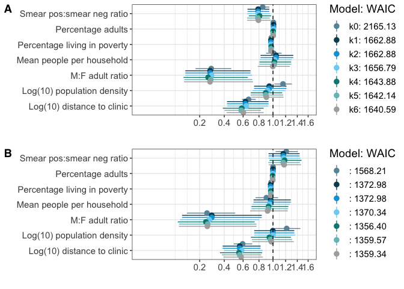<!-- -->

```r
ggsave(file="S3_fig.pdf", width=10, height=12, dpi=300, 
       path = here("figures"))
```


All TB cases final model

Select model with lowest WAIC (i.e. k6)


```r
#Overall model summary
summary(all_6)
```

```
##  Family: poisson 
##   Links: mu = log 
## Formula: n_cases ~ mean_people_per_hh + log_popdens + log_clinic_distance + mwi11povcons200 + m_f_adult_ratio + prop_adults + smr_ratio + offset(log(total)) 
##    Data: dat (Number of observations: 315) 
## Samples: 3 chains, each with iter = 4000; warmup = 1000; thin = 1;
##          total post-warmup samples = 9000
## 
## Correlation Structures:
##       Estimate Est.Error l-95% CI u-95% CI Eff.Sample Rhat
## car       0.96      0.04     0.86     1.00        495 1.01
## sdcar     1.12      0.08     0.97     1.30       2185 1.00
## 
## Population-Level Effects: 
##                     Estimate Est.Error l-95% CI u-95% CI Eff.Sample Rhat
## Intercept              -1.39      1.62    -4.56     1.80       2427 1.00
## mean_people_per_hh     -0.00      0.12    -0.24     0.24       3163 1.00
## log_popdens            -0.10      0.13    -0.36     0.15       2517 1.00
## log_clinic_distance    -0.51      0.18    -0.86    -0.15       1547 1.00
## mwi11povcons200        -0.03      0.01    -0.04    -0.02        798 1.01
## m_f_adult_ratio        -1.29      0.48    -2.22    -0.33       3478 1.00
## prop_adults             0.00      0.01    -0.02     0.02       3157 1.00
## smr_ratio              -0.23      0.10    -0.43    -0.03       4093 1.00
## 
## Samples were drawn using sampling(NUTS). For each parameter, Eff.Sample 
## is a crude measure of effective sample size, and Rhat is the potential 
## scale reduction factor on split chains (at convergence, Rhat = 1).
```

```r
#Model diagnostics
plot(all_6, ask = FALSE)
```

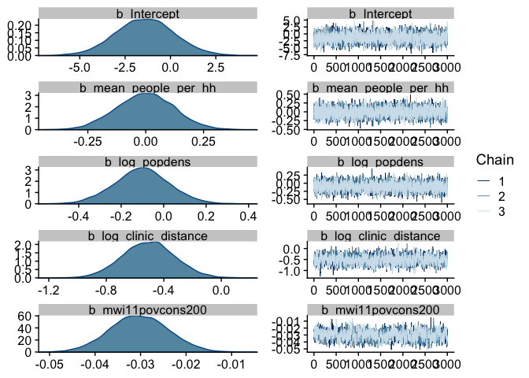<!-- -->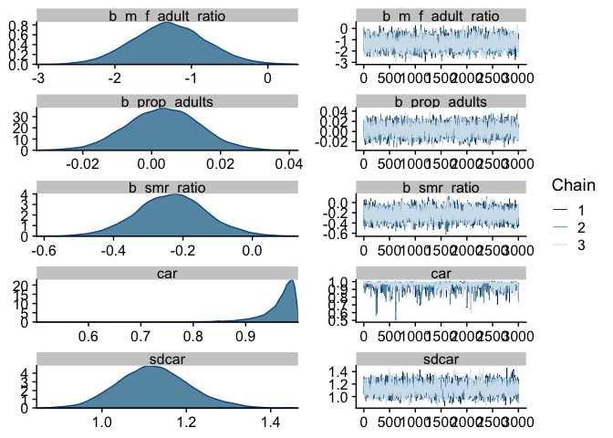<!-- -->

```r
pp_all_6 <- as_tibble(predict(all_6))
pp_all_6 <- dat %>%
  dplyr::select(c02hsaid, n_cases) %>%
  bind_cols(pp_all_6) %>%
  mutate(diff=n_cases - Estimate) %>%
  mutate(abdiff = abs(diff)) %>%
  arrange(diff) %>%
  mutate(c02hsaid = factor(c02hsaid))

residual1 <- pp_all_6 %>%
  ggplot() +
  geom_linerange(aes(x=fct_reorder(c02hsaid, n_cases, .desc=TRUE), ymin=n_cases, ymax=Estimate), alpha=0.7) +
  geom_point(aes(x=fct_reorder(c02hsaid, n_cases, .desc=TRUE), y=n_cases), colour="firebrick") +
  geom_point(aes(x=fct_reorder(c02hsaid, n_cases, .desc=TRUE), alpha=abdiff, y=Estimate), colour="steelblue") +
  theme_classic() +
  labs(x="",
       y="Observed (red) and predicted (blue) TB cases") +
  theme(axis.ticks.x = element_blank(),
        axis.text.x = element_blank()) +
  theme(legend.position="none")

ggsave(file="residual1.pdf", width=12, height=6, dpi=300, 
       path = here("figures"))


##Model estimates
ests_all_6<- tidy(exp(fixef(all_6)))
```

```
## Warning: 'tidy.matrix' is deprecated.
## See help("Deprecated")
```

```r
ests_all_6 %>%
  kable()
```


.rownames               Estimate   Est.Error        Q2.5       Q97.5
--------------------  ----------  ----------  ----------  ----------
Intercept              0.2479124    5.041818   0.0104464   6.0543422
mean_people_per_hh     0.9976956    1.131665   0.7840444   1.2709775
log_popdens            0.9028756    1.137175   0.7006123   1.1647809
log_clinic_distance    0.6031365    1.200330   0.4222298   0.8637051
mwi11povcons200        0.9701859    1.006422   0.9582362   0.9825233
m_f_adult_ratio        0.2758934    1.621432   0.1080857   0.7220805
prop_adults            1.0033398    1.010484   0.9829655   1.0241798
smr_ratio              0.7924667    1.106109   0.6485303   0.9695509


Select model with lowest WAIC for microbiologically-confirmed TB (i.e. k4).


```r
#Overall model summary
summary(micro_4)
```

```
##  Family: poisson 
##   Links: mu = log 
## Formula: n_micro_cases ~ mean_people_per_hh + log_popdens + log_clinic_distance + mwi11povcons200 + m_f_adult_ratio + prop_adults + smr_ratio + offset(log(total)) 
##    Data: dat (Number of observations: 315) 
## Samples: 3 chains, each with iter = 4000; warmup = 1000; thin = 1;
##          total post-warmup samples = 9000
## 
## Correlation Structures:
##       Estimate Est.Error l-95% CI u-95% CI Eff.Sample Rhat
## car       0.93      0.06     0.76     0.99        518 1.02
## sdcar     0.84      0.09     0.68     1.02        993 1.00
## 
## Population-Level Effects: 
##                     Estimate Est.Error l-95% CI u-95% CI Eff.Sample Rhat
## Intercept              -1.17      1.87    -4.78     2.49       2462 1.00
## mean_people_per_hh     -0.07      0.15    -0.35     0.22       3638 1.00
## log_popdens            -0.06      0.16    -0.36     0.25       1926 1.00
## log_clinic_distance    -0.59      0.22    -1.02    -0.17       1322 1.00
## mwi11povcons200        -0.03      0.01    -0.05    -0.02        918 1.01
## m_f_adult_ratio        -1.41      0.57    -2.53    -0.30       3050 1.00
## prop_adults            -0.01      0.01    -0.03     0.02       3044 1.00
## smr_ratio               0.17      0.11    -0.05     0.39       5478 1.00
## 
## Samples were drawn using sampling(NUTS). For each parameter, Eff.Sample 
## is a crude measure of effective sample size, and Rhat is the potential 
## scale reduction factor on split chains (at convergence, Rhat = 1).
```

```r
#Model diagnostics
plot(micro_4, ask = FALSE)
```

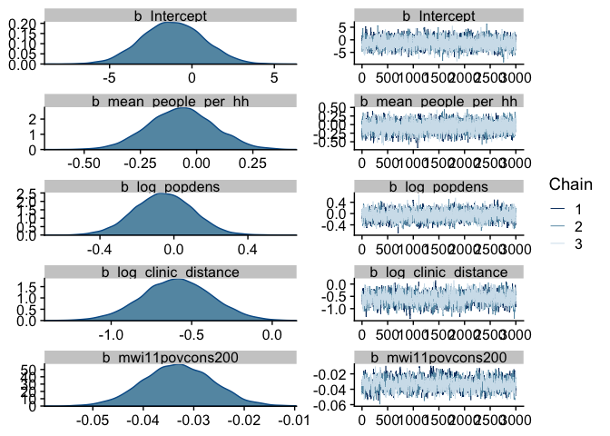<!-- -->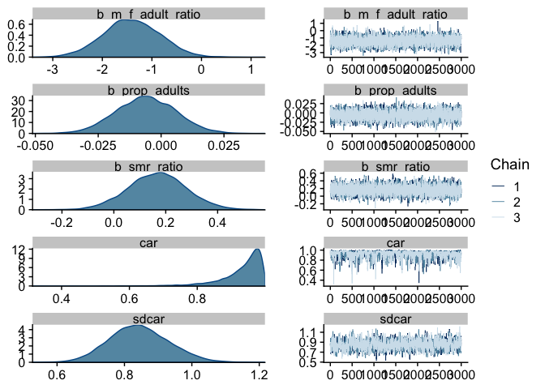<!-- -->

```r
pp_micro_4 <- as_tibble(predict(micro_4))
pp_micro_4 <- dat %>%
  dplyr::select(c02hsaid, n_micro_cases) %>%
  bind_cols(pp_micro_4) %>%
  mutate(diff=n_micro_cases - Estimate) %>%
  mutate(abdiff = abs(diff)) %>%
  arrange(diff) %>%
  mutate(c02hsaid = factor(c02hsaid))

residual2 <- pp_micro_4 %>%
  ggplot() +
  geom_point(aes(x=fct_reorder(c02hsaid, n_micro_cases, .desc=TRUE), y=n_micro_cases), colour="firebrick") +
  geom_point(aes(x=fct_reorder(c02hsaid, n_micro_cases, .desc=TRUE), alpha=abdiff, y=Estimate), colour="steelblue") +
  geom_linerange(aes(x=fct_reorder(c02hsaid, n_micro_cases, .desc=TRUE), ymin=n_micro_cases, ymax=Estimate), alpha=0.7) +
  theme_classic() +
  labs(x="",
       y="Observed (red) and predicted (blue) TB cases") +
  theme(axis.ticks.x = element_blank(),
        axis.text.x = element_blank()) +
  theme(legend.position="none")

ggsave(file="residual2.pdf", width=12, height=6, dpi=300, 
       path = here("figures"))


##Model estimates
ests_micro_4<- tidy(exp(fixef(micro_4)))
```

```
## Warning: 'tidy.matrix' is deprecated.
## See help("Deprecated")
```

```r
ests_micro_4 %>%
  kable()
```


.rownames               Estimate   Est.Error        Q2.5        Q97.5
--------------------  ----------  ----------  ----------  -----------
Intercept              0.3088692    6.508773   0.0084007   12.0540961
mean_people_per_hh     0.9338651    1.157441   0.7018943    1.2452773
log_popdens            0.9461945    1.170719   0.6953284    1.2887216
log_clinic_distance    0.5531652    1.240754   0.3602911    0.8433562
mwi11povcons200        0.9674796    1.006932   0.9544993    0.9808116
m_f_adult_ratio        0.2441698    1.769811   0.0793835    0.7424614
prop_adults            0.9940236    1.011833   0.9714743    1.0170436
smr_ratio              1.1821419    1.118692   0.9482091    1.4768478

<br>

## 17. Figure 3: Marginal Effects plot


```r
me <- marginal_effects(all_6, 
                       conditions = data.frame(total = seq(1000,15000, 250)))
me2 <- marginal_effects(micro_4, conditions = data.frame(total = seq(1000,15000, 250)))

p1 <- me[[1]]
p1 <- p1 %>%
  mutate(rate=(estimate__/total)*100000) %>%
  mutate(l95 = (lower__/total)*100000) %>%
  mutate(u95 = (upper__/total)*100000) %>%
  dplyr::select(rate, l95,u95, value=mean_people_per_hh) %>% 
  mutate(type="All TB") %>%
  mutate(param = "Mean people per household") 

p2 <- me[[2]]
p2 <- p2 %>%
  mutate(rate=(estimate__/total)*100000) %>%
  mutate(l95 = (lower__/total)*100000) %>%
  mutate(u95 = (upper__/total)*100000) %>%
  dplyr::select(rate, l95,u95, value=log_popdens) %>% 
  mutate(type="All TB") %>%
  mutate(param = "Log population density")

p3 <- me[[3]]
p3 <- p3 %>%
  mutate(rate=(estimate__/total)*100000) %>%
  mutate(l95 = (lower__/total)*100000) %>%
  mutate(u95 = (upper__/total)*100000) %>%
  dplyr::select(rate, l95,u95, value=log_clinic_distance) %>% 
  mutate(type="All TB") %>%
  mutate(param = "Log clinic distance")

p4 <- me[[4]]
p4 <- p4 %>%
  mutate(rate=(estimate__/total)*100000) %>%
  mutate(l95 = (lower__/total)*100000) %>%
  mutate(u95 = (upper__/total)*100000) %>%
  dplyr::select(rate, l95,u95, value=mwi11povcons200) %>% 
  mutate(type="All TB") %>%
  mutate(param = "Percentage living in poverty")

p5 <- me[[5]]
p5 <- p5 %>%
  mutate(rate=(estimate__/total)*100000) %>%
  mutate(l95 = (lower__/total)*100000) %>%
  mutate(u95 = (upper__/total)*100000) %>%
  dplyr::select(rate, l95,u95, value=m_f_adult_ratio) %>% 
  mutate(type="All TB") %>%
  mutate(param = "M:F adult ratio")

p6 <- me[[6]]
p6 <- p6 %>%
  mutate(rate=(estimate__/total)*100000) %>%
  mutate(l95 = (lower__/total)*100000) %>%
  mutate(u95 = (upper__/total)*100000) %>%
  dplyr::select(rate, l95,u95, value=prop_adults) %>% 
  mutate(type="All TB") %>%
  mutate(param = "Percentage adults")

p7 <- me[[7]]
p7 <- p7 %>%
  mutate(rate=(estimate__/total)*100000) %>%
  mutate(l95 = (lower__/total)*100000) %>%
  mutate(u95 = (upper__/total)*100000) %>%
  dplyr::select(rate, l95,u95, value=smr_ratio) %>% 
  mutate(type="All TB") %>%
  mutate(param = "Smear positive:negative ratio")

p8 <- me2[[1]]
p8 <- p8 %>%
  mutate(rate=(estimate__/total)*100000) %>%
  mutate(l95 = (lower__/total)*100000) %>%
  mutate(u95 = (upper__/total)*100000) %>%
  dplyr::select(rate, l95,u95, value=mean_people_per_hh) %>% 
  mutate(type="Microbiologically-confirmed TB") %>%
  mutate(param = "Mean people per household")

p9 <- me2[[2]]
p9 <- p9 %>%
  mutate(rate=(estimate__/total)*100000) %>%
  mutate(l95 = (lower__/total)*100000) %>%
  mutate(u95 = (upper__/total)*100000) %>%
  dplyr::select(rate, l95,u95, value=log_popdens) %>% 
  mutate(type="Microbiologically-confirmed TB") %>%
  mutate(param = "Log population density")

p10 <- me2[[3]]
p10 <- p10 %>%
  mutate(rate=(estimate__/total)*100000) %>%
  mutate(l95 = (lower__/total)*100000) %>%
  mutate(u95 = (upper__/total)*100000) %>%
  dplyr::select(rate, l95,u95, value=log_clinic_distance) %>% 
  mutate(type="Microbiologically-confirmed TB") %>%
  mutate(param = "Log clinic distance")

p11 <- me2[[4]]
p11 <- p11 %>%
  mutate(rate=(estimate__/total)*100000) %>%
  mutate(l95 = (lower__/total)*100000) %>%
  mutate(u95 = (upper__/total)*100000) %>%
  dplyr::select(rate, l95,u95, value=mwi11povcons200) %>% 
  mutate(type="Microbiologically-confirmed TB") %>%
  mutate(param = "Percentage living in poverty")

p12 <- me2[[5]]
p12 <- p12 %>%
  mutate(rate=(estimate__/total)*100000) %>%
  mutate(l95 = (lower__/total)*100000) %>%
  mutate(u95 = (upper__/total)*100000) %>%
  dplyr::select(rate, l95,u95, value=m_f_adult_ratio) %>%
  mutate(type="Microbiologically-confirmed TB") %>%
  mutate(param = "M:F adult ratio")

p13 <- me2[[6]]
p13 <- p13 %>%
  mutate(rate=(estimate__/total)*100000) %>%
  mutate(l95 = (lower__/total)*100000) %>%
  mutate(u95 = (upper__/total)*100000) %>%
  dplyr::select(rate, l95,u95, value=prop_adults) %>%
  mutate(type="Microbiologically-confirmed TB") %>%
  mutate(param = "Percentage adults")

p14 <- me2[[7]]
p14 <- p14 %>%
  mutate(rate=(estimate__/total)*100000) %>%
  mutate(l95 = (lower__/total)*100000) %>%
  mutate(u95 = (upper__/total)*100000) %>%
  dplyr::select(rate, l95,u95, value=smr_ratio) %>%
  mutate(type="Microbiologically-confirmed TB") %>%
  mutate(param = "Smear positive:negative ratio")

pz <- bind_rows(p1, p2, p3, p4, p5, p6, p7,
                p8, p9, p10, p11, p12, p13, p14)


ggplot(pz) +
  geom_line(aes(x=value, y=rate, group=type, colour=type)) +
  geom_ribbon(aes(x=value, ymin=l95, ymax=u95, group=type, fill=type), alpha=0.3) +
  facet_wrap(~param, scales = "free") +
  ylim(0,1200) +
  ylab("TB case notification rate per 100,000 (95% credible interval)") +
  xlab("") +
  theme_minimal() +
  theme(legend.position="none")
```

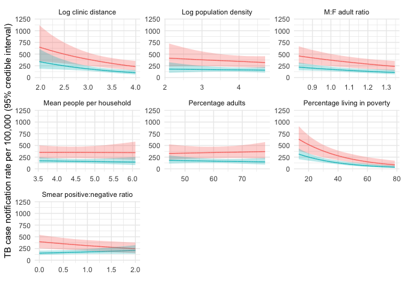<!-- -->

```r
ggsave(file="Figure3.pdf", width=8, height=8, dpi=300, 
       path = here("figures"))
```


<br>

##18. Supplemental Figure 4: Predicted and observed TB case notifications


```r
plot_grid(residual1, residual2,
          labels = c("A", "B"), ncol = 1,
          label_fontfamily = "Helvetica")
```

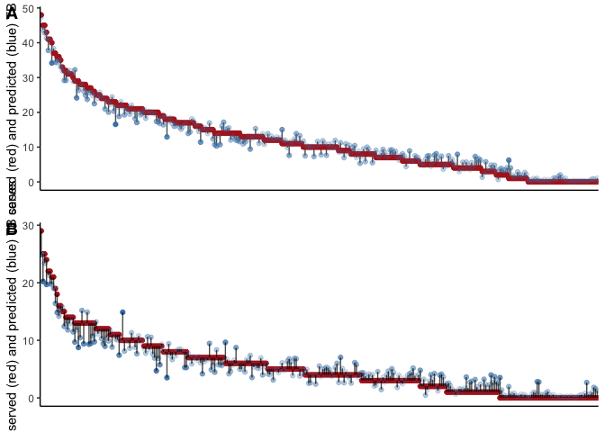<!-- -->

```r
ggsave(file="S4_Fig.pdf", width=8, height=8, dpi=300, 
       path = here("figures"))
```


